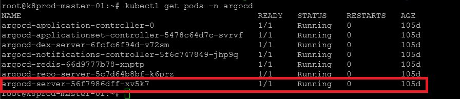
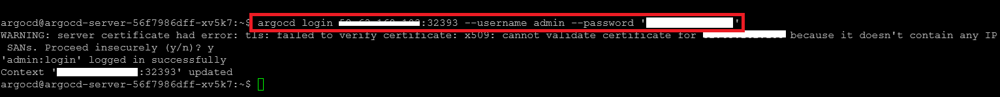
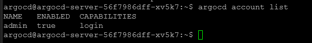
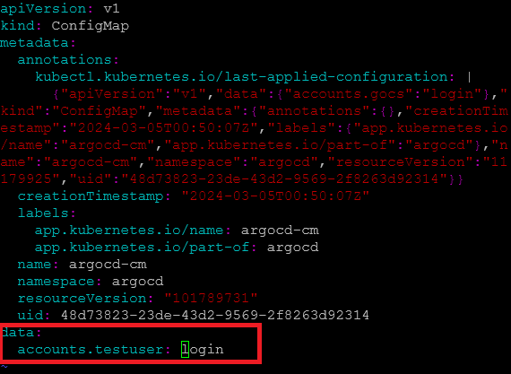
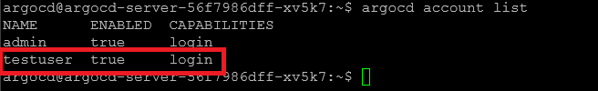
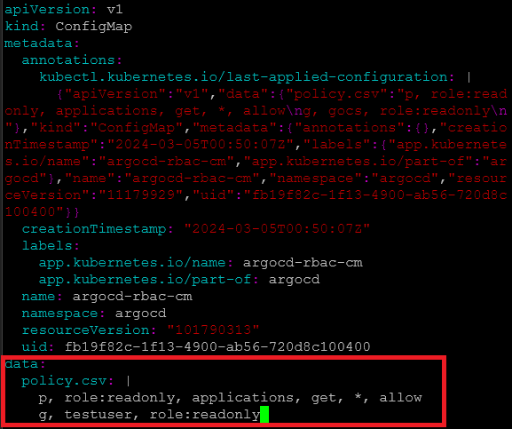
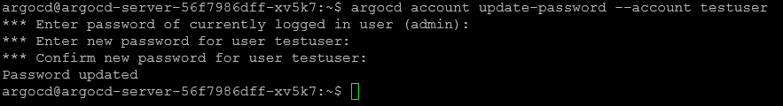

# Create a New User in Argo CD

## Description

This process will create a new user in Argo CD, configure RBAC permissions, and set a password for access.

## Prerequisites

+ Log in to the `Master` Server.
+ Access the `argocd-server` pod.


## Setup

### Verify the Name of the argocd-server Pod

To find the name of the pod, run the following command:

```bash
kubectl get pods -n argocd
```

Sample Output:



### Enter the argocd-server Pod

Once you have the pod name, use the following command to enter the argocd-server pod:

```bash
kubect exec -it argocd-server-56f7986dff-xv5k7 -n argocd /bin/bash
```

### Log In to Argo CD

To log in to Argo CD, use the following command:

```bash
argocd login <url>:<port> --username <username> --password <password>
```

Note: Replace the placeholders <url>, <port>, <username>, and <password> with the actual values for your Argo CD setup.

Sample Command:



### List All Accounts in Argo CD

To view all accounts in Argo CD, run:

```bash
argocd account list
```

This command will display all available accounts in your Argo CD. For example, if only the admin account exists, you will see only that.



### Add a New Account

Argo CD uses a configmap to manage accounts. To add a new user, follow these steps:

Retrieve the ConfigMap

First, get the argocd-cm ConfigMap:

```bash
kubectl get configmap argocd-cm -n argocd -o yaml > argocd-cm.yaml
```

Edit the ConfigMap

Open the argocd-cm.yaml file and add the following line under the data section:

```bash
data:
  accounts.testuser: login
```

For example:



Apply the Changes

To apply the changes, run:

```bash
kubectl apply -n argocd  -f argocd-cm.yaml
```

### Verify the New Account

After applying the changes, enter the argocd-server pod again and check if the new account is listed:

```bash
argocd account list
```

You should see the newly added account in the output.



### Configure RBAC (Role-Based Access Control)

Next, configure RBAC for the new user. To do this, retrieve the argocd-rbac-cm ConfigMap:

```bash
kubectl get configmap argocd-rbac-cm -n argocd -o yaml > argocd-rbac-cm.yml
```

Edit the RBAC ConfigMap

Open the argocd-rbac-cm.yml file, and for the newly created account, add a read-only access rule under the data section:

```bash
data:
  policy.csv: |
    p, role:readonly, applications, get, *, allow
    g, testuser, role:readonly
```

Sample output:



You can replace readonly with other permissions like readwrite, readexecute, or admin depending on the level of access you want to grant the account.

Apply the RBAC Changes

To apply the RBAC configuration, run:

```bash
kubectl apply -n argocd -f argocd-rbac-cm.yml
```

### Set a Password for the New Account

The final step is to create a password for the new account. To set a password, use the following command:

```bash
argocd account update-password --account <new-account-name>
```

Sample Output:



Once the password is set, you can use the account credentials to log in to the Argo CD UI and CLI.
