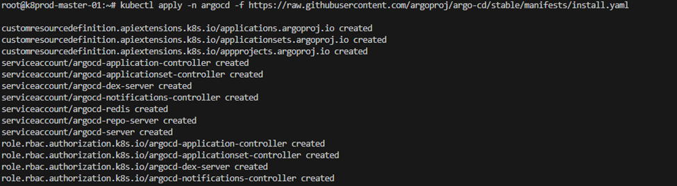
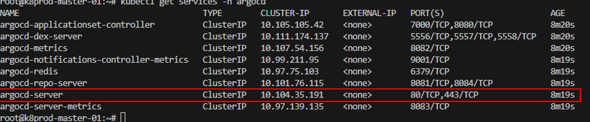
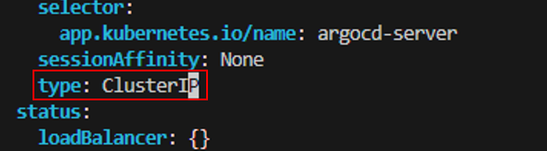
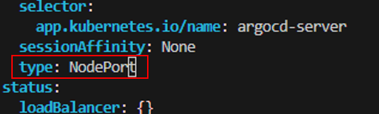
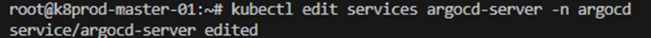
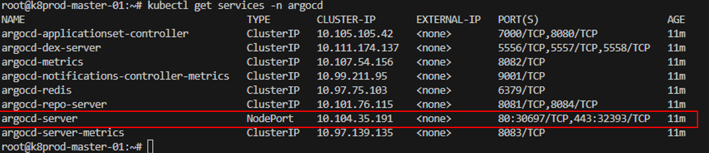
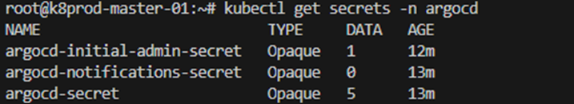

# Deploying Argo CD: My Step-by-Step Journey 


Argo CD has been a game-changer in my Kubernetes deployment workflow. As I explored its capabilities, I decided to document my experience setting it up from scratch. This guide walks you through the exact steps I took to deploy Argo CD, ensuring seamless automation and continuous delivery for Kuberne

## Step 1: Creating a Namespace and Installing Argo CD

The first step I took was creating a dedicated namespace and applying the official Argo CD YAML manifest.

```bash
kubectl create namespace argocd
kubectl apply -n argocd -f https://raw.githubusercontent.com/argoproj/argo-cd/stable/manifests/install.yaml
```

Result: 



## Step 2: Updating the Argo CD Service Type

By default, Argo CD is deployed with the ClusterIP service type, which isn't accessible externally. I needed to change this to NodePort to allow access from outside the cluster.

### Checking the current service configuration:

```bash
kubectl get services -n argocd
```

Output:



### Editing the argocd-server service:

```bash
kubectl edit service argocd-server -n argocd
```

Modified the YAML from:



To:



### Saved the changes and confirmed the update:

```bash
kubectl get services -n argocd
```

Result after modification:



## Step 3: Retrieving the NodePort Assigned to Argo CD

After modifying the service type, I needed to check which port Argo CD was assigned.

```bash
kubectl get services -n argocd
```

Example Output:



As shown, Argo CD is now accessible via ports 30697 and 32393.

## Step 4: Retrieving and Decoding the Default Admin Password

To log in to the Argo CD UI, I had to decode the default admin password stored in a Kubernetes secret.

### Listing the available secrets:

```bash
kubectl get secrets -n argocd
```

Example Output:



Retrieving and decoding the admin password:

```bash
kubectl get secret argocd-initial-admin-secret -n argocd -o jsonpath="{.data.password}" | base64 -d
```

The output displayed my initial admin password.

## Step 5: Accessing the Argo CD Web UI

Now that I had the credentials, I proceeded to access the Argo CD dashboard.

### I opened a web browser and navigated to:

```bash
https://<MASTER-NODE-IP-ADDRESS>:<PORT>
```

Note: <PORT> should be replaced with the NodePort obtained in Step 3.

### Logged in using:
+ Username: admin
+ Password: (Decoded password from Step 4)

🎉 Success! I had successfully deployed and accessed Argo CD.

## Final Thoughts

This was a great learning experience for me as I explored how to set up and configure Argo CD. By following these steps, I automated Kubernetes application deployment using GitOps best practices.