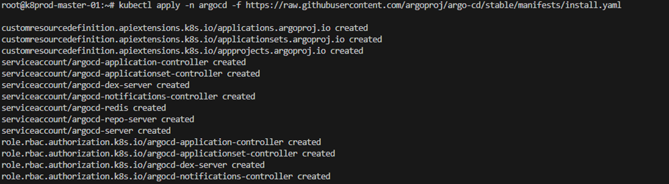
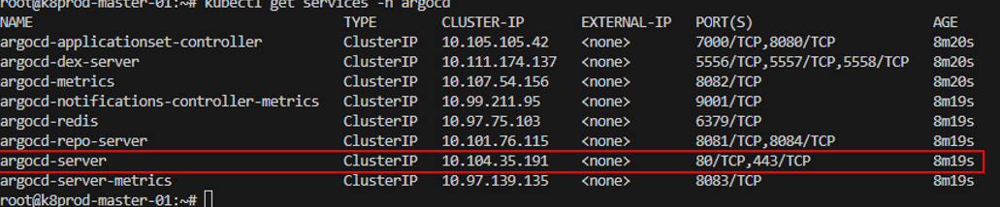
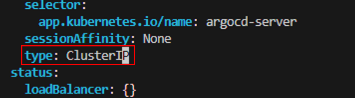
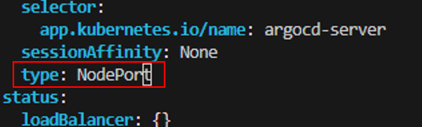
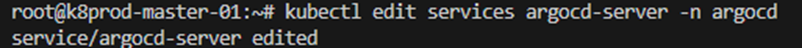
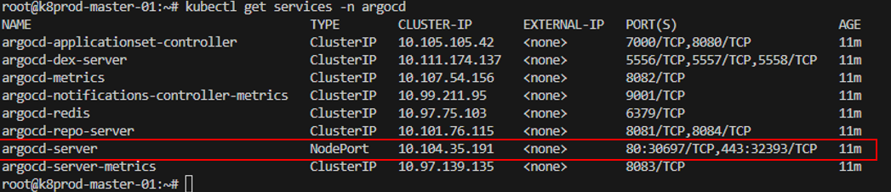
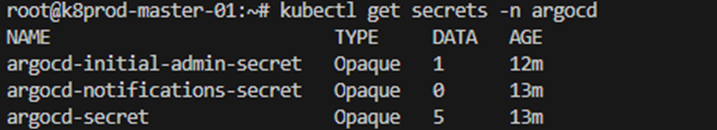

# Deploying Argo CD: A Comprehensive Guide 🐙

## Introduction

Argo CD is a powerful tool for continuous delivery in Kubernetes environments, allowing you to manage your applications with GitOps principles. In this step-by-step guide, we'll show you how to deploy Argo CD, ensuring you can efficiently automate the deployment and monitoring of your Kubernetes applications.

## Steps:-

**Step 1** — Create namespace for ArgoCD

**Step 2** — Change the ArgoCD service type into the yaml file from ClusterIp to NodePort

**Step 3** — Getting the port number of Argo CD service for UI

**Step 4** — Check the default password by decoding the password to Base64

**Step 5** — Login to the Argocd UI for the confirmation

## Let's Start!:-

**Step 1** — Create namespace for ArgoCD and apply ArgoCD yaml files
```
$ kubectl create namespace argocd
$ kubectl apply -n argocd -f https://raw.githubusercontent.com/argoproj/argo-cd/stable/manifests/install.yaml
```

Result:



**Step 2** — Change the ArgoCD service type into the yaml file from ClusterIp to NodePort

Check first the service
```
$ kubectl get services -n argocd
```

Result:



Modify argocd service yaml file
```
$ kubectl edit services argocd-server -n argocd
```

From:



To:



and save the yaml file,

Result after saving the yaml file:



**Step 3** — Getting the port number of Argo CD service for UI

Check the port number assigned by the NodePort service.
```
$ kubectl get services -n argocd
```



As you can see in the above picture, the new port number of argocd-server service is now port 30697 and port 32393.

**Step 4** — Check the default password by decoding the password to Base64

Check the Argo CD secrets.
```
$ kubectl get secrets -n argocd
```

Result:



View the password
```
$ kubectl edit secrets argocd-initial-admin-secret -n argocd
$ echo -n ‘aHdZTm96YW0tMVI3enkxUw==’ | base64 -d
```

**Step 5** — Login to the Argocd UI for the confirmation

Open a web browser and input the URL.
```
https://<MASTER-NODE-IP-ADDRESS>:<PORT>
```

**Note:*** PORT is a port number from Step 3.

## Final Note

If you find this repository useful for learning, please give it a star on GitHub. Thank you!

**Authored by:** [ELemenoppee](https://github.com/ELemenoppee)
