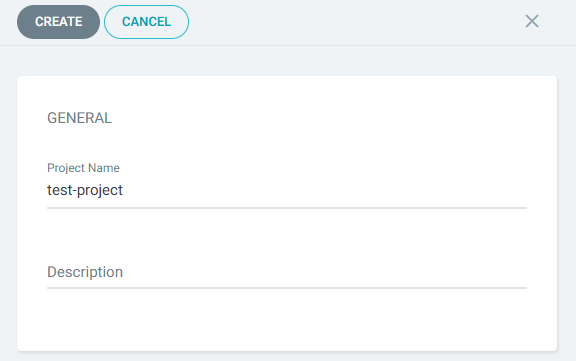
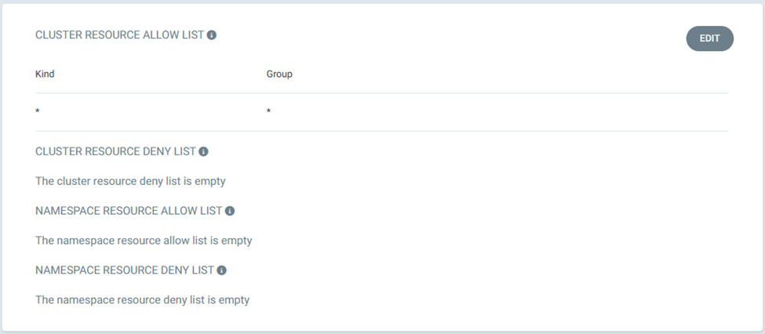

# Configuring Project Names in Argo CD: A Step-by-Step Guide 👾

## Introduction

Effective project name configuration is crucial for managing and organizing your applications in Argo CD. This guide provides a detailed procedure on setting up and configuring project names in Argo CD, ensuring a structured and efficient deployment process for your Kubernetes applications.

## Steps:-

**Step 1** — Login to ArgoCD UI

**Step 2** — Click "Settings" > "Projects" > "New Projects" > "Input Project Name" > Create

**Step 3** — Set Source Repositories

**Step 4** — Set Destinations

**Step 5** — Set Cluster Resource Allow List

## Final Note

If you find this repository useful for learning, please give it a star on GitHub. Thank you!

**Authored by:** [ELemenoppee](https://github.com/ELemenoppee)
