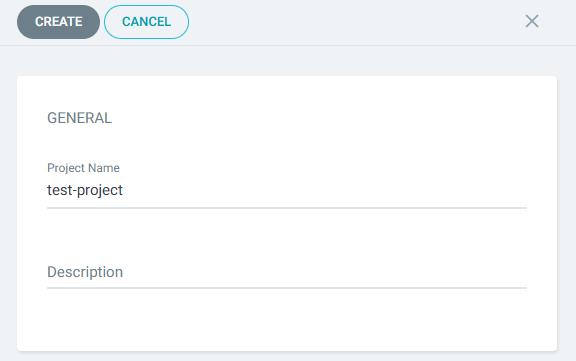
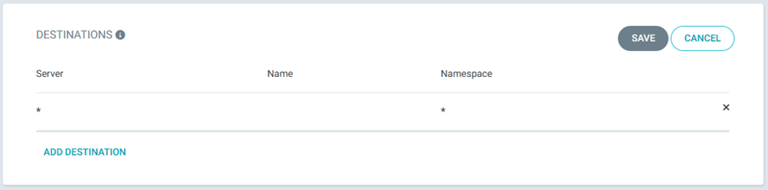
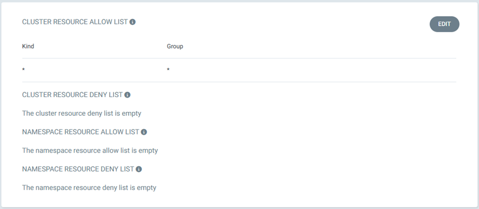

# Configuring Project Names in Argo CD: A Step-by-Step Guide 👾

When I started working with Argo CD, I quickly realized how important it is to properly configure project names. A well-structured project setup helps keep applications organized, improves security, and simplifies deployments in a Kubernetes environment.

In this guide, I’ll share the exact steps I followed to configure project names in Argo CD, making the process smooth and efficient.

## Step 1: Logging into the Argo CD UI

The first thing I did was log into the Argo CD dashboard using my credentials.

## Step 2: Creating a New Project

Once inside the dashboard, I navigated through the following steps to create a new project:

🔹 Settings → Projects → New Project

🔹 Entered a Project Name

🔹 Clicked Create

This step officially set up my project in Argo CD, preparing it for further configuration.

## Step 3: Defining Source Repositories

Next, I specified the Git repositories that hold my application manifests and configurations. This ensures that Argo CD can pull the latest updates and deploy them correctly.

## Step 4: Configuring Deployment Destinations

I then defined the Kubernetes clusters where my applications should be deployed. This ensures that each workload is running in the correct environment.

## Step 5: Setting Cluster Resource Allow List

Finally, I configured the Cluster Resource Allow List, which controls what cluster-level resources my project can access. This is an important security step to ensure proper access management.

## Final Thoughts

By following these steps, I successfully configured project names in Argo CD and improved the organization and security of my Kubernetes applications. This setup has made managing deployments much easier for me.

I hope this guide helps you as well! 🚀