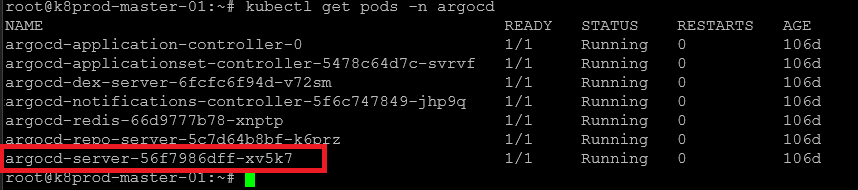
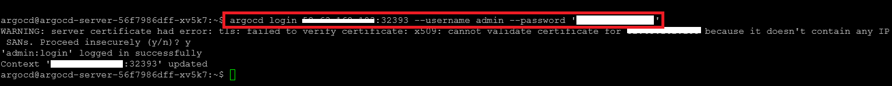
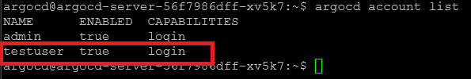
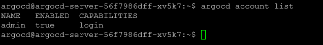
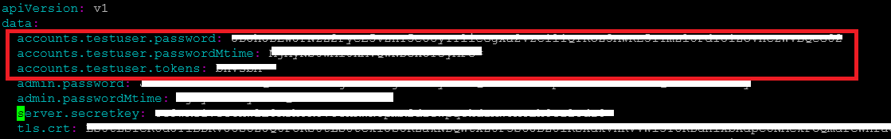

# Removing a User in ArgoCD

## Prerequisites

+ Ensure you have access to the Master Server.
+ You must have appropriate permissions to modify ArgoCD configurations.

## Setup

### Access the ArgoCD Server Pod

Log in to the Master Server.

Identify the ArgoCD server pod name by running:

```bash
kubectl get pods -n argocd
```

Expected Output:



### Enter the ArgoCD server pod by executing:

```bash
kubectl exec -it argocd-server-56f7986dff-xv5k7 -n argocd /bin/bash
```

### Log in to ArgoCD

Inside the ArgoCD pod, authenticate using:

```bash
argocd login <url>:<port> --username <username> --password <password>
```

Example Output:



### List All ArgoCD Accounts

To display all existing ArgoCD user accounts, run:

```bash
argocd account list
```
Example Output:



### Remove the User from ArgoCD ConfigMap

Retrieve the argocd-cm ConfigMap and save it to a local file:

```bash
kubectl get configmap argocd-cm -n argocd -o yaml > argocd-cm.yaml
```

Open the argocd-cm.yaml file in a text editor and remove the following entry under the data section:

```bash
data:
  accounts.testuser: login
```

Apply the updated ConfigMap:

```bash
kubectl apply -n argocd  -f argocd-cm.yaml
```

### Verify Account Removal

Re-enter the ArgoCD server pod (if you exited earlier):

```bash
kubectl exec -it <argocd-server-pod-name> -n argocd -- /bin/bash
```

Run the following command to check if the removed account is still listed:

```bash
argocd account list
```

Expected Output:



### Update RBAC Configuration

Retrieve the argocd-rbac-cm ConfigMap and save it locally:

```bash
kubectl get configmap argocd-rbac-cm -n argocd -o yaml > argocd-rbac-cm.yml
```

Open the argocd-rbac-cm.yml file and remove the following entry under the data section:

```bash
data:
  policy.csv: |
    p, role:readonly, applications, get, *, allow
    g, crunchops, role:readonly
```

Apply the updated RBAC configuration:

```bash
kubectl apply -n argocd -f argocd-rbac-cm.yml
```

### Remove User Credentials from Secrets

Retrieve the argocd-secret resource and save it locally:

```bash
kubectl get secrets argocd-secret -n argocd -o yaml > argocd-secret.yml
```

Open the argocd-secret.yml file and remove the user-specific entry under the data section.



Apply the updated secret configuration:

```bash
kubectl apply -n argocd -f argocd-secret.yml
```

