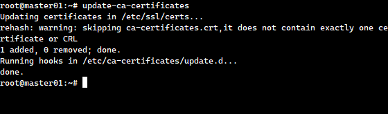
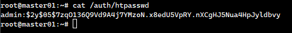
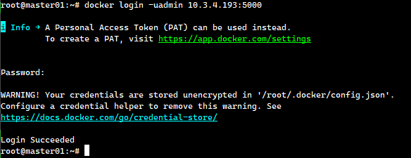
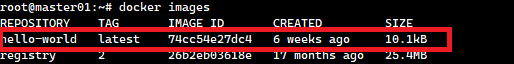
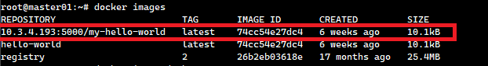
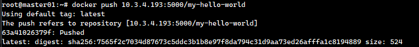
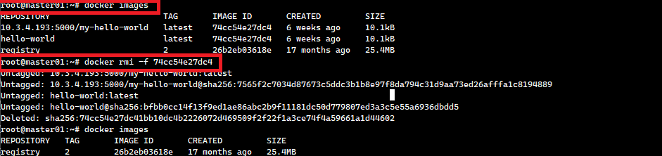
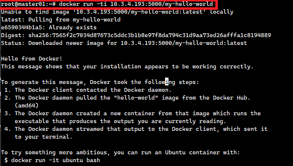
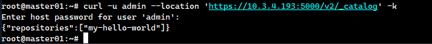

# How to Set Up a Secure Private Docker Registry with Authentication and SSL

Docker registries help you store and distribute container images/images. But what if you want to keep your images/images private and secure? This guide walks you through setting up your own private Docker registry with SSL encryption and user authentication so that only authorized users can access your container images/images.

## 🚀 Why Set Up a Private Docker Registry?

+ Security: Control access to your container images/images

+ Speed: Faster deployments without relying on external registries

+ Cost Savings: Reduce bandwidth costs from pulling images/images repeatedly

Let's get started! 🛠️

## Step 1: Install Docker Engine

Docker is required to run a private registry. If you haven’t installed it yet, follow the official guide:

```sh 
https://docs.docker.com/engine/install/ubuntu/
```

Once installed, start and enable Docker:

```sh
sudo systemctl start docker
sudo systemctl enable docker
```

Verify the installation:

```sh
docker --version
```

## Step 2: Generate an SSL Certificate

To secure your registry, generate a self-signed SSL certificate:

```sh
sudo mkdir /certs
sudo openssl req -newkey rsa:4096 -nodes -sha256 -keyout /certs/domain.key -x509 -days 365 -out /certs/domain.crt
```

Follow the prompts to provide necessary details (country, state, common name, etc.).

## Step 3: Install SSL Certificates on Server and Client

Now, install the SSL certificates on both the server and the client:

```sh
mkdir -p /etc/docker/certs.d/<ip_address>:5000
cp /certs/domain.crt /etc/docker/certs.d/<ip_address>:5000/ca.crt
cp /certs/domain.crt /usr/local/share/ca-certificates/ca.crt
update-ca-certificates
```

Sample output:



## Step 4: Configure Docker Daemon

Tell Docker to recognize your private registry:

```sh
sudo vi /etc/docker/daemon.json
```

Add this JSON configuration:

```sh
{
  "insecure-registries": [],
  "registry-mirrors": [],
  "insecure-registries": ["your-domain-or-ip:5000"]
}
```

Save and exit, then restart Docker:

```sh
sudo systemctl restart docker
```

## Step 5: Enable Authentication for Registry Access

To add user authentication, install htpasswd:

```sh
sudo apt-get install apache2-utils
```

Create a directory for authentication files:

```sh
mkdir -p /auth
```

Generate a username and password:

```sh
htpasswd -B -c /auth/htpasswd admin
```

Verify the credentials:

```sh
cat /auth/htpasswd
```

Which looks something similar to the below one



Restart Docker to apply changes:

```sh
systemctl restart docker
```

## Step 6: Start Your Private Docker Registry

Run the Docker registry with SSL and authentication:

```sh
docker run -d -p 5000:5000 --restart=always --name registry -v /certs:/certs -v /auth:/auth -v /var/lib/registry:/var/lib/registry -e REGISTRY_HTTP_TLS_CERTIFICATE=/certs/domain.crt -e REGISTRY_HTTP_TLS_KEY=/certs/domain.key -e "REGISTRY_AUTH_HTPASSWD_REALM=Registry Realm" -e REGISTRY_AUTH_HTPASSWD_PATH=/auth/htpasswd -e REGISTRY_AUTH=htpasswd registry:2
```

## Step 7: Verify Registry Access & images/image Operations

✅ Login to the Private Registry

```sh
docker login -uadmin <ip_address>:5000
```

sample output:



✅ Check Installed Docker images/images

```sh
docker images/images
```

sample output:



✅ Tag an images/image for the Private Registry

```sh
docker tag hello-world <ip_address>:5000/my-hello-world
```

sample output:



✅ Push the images/image to the Private Registry

```sh
docker push <ip_address>:5000/my-hello-world
```

sample output:



✅ Remove Local images/image to Test Pulling

```sh
docker rmi -i <images/image_id>
```

sample output:



✅ Pull the images/image from the Private Registry

```sh
docker run -ti <ip_address>:5000/my-hello-world
```

sample output:



✅ Logout from the Private Registry

```sh
docker logout
```

## Step 8: List All Repositories in Your Private Registry

Retrieve a list of all stored images/images in the registry:

```sh
curl -u admin --location 'https://<ip_address>:5000/v2/_catalog' -k
```

sample output:



## 🎉 Conclusion

You’ve successfully set up a secure private Docker registry with authentication and SSL! Now you can store, manage, and deploy your container images/images securely. 🚀