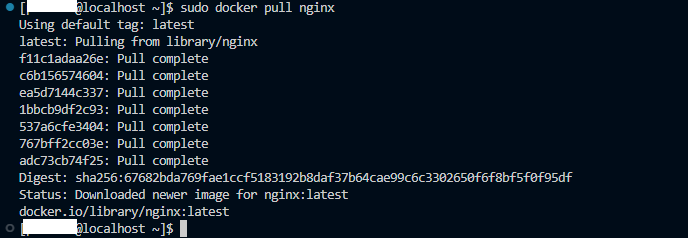

# 🤖 How to Configure a Private Docker Registry: A Step-by-Step Guide


## Description 

Need to securely manage and store your Docker images? This comprehensive guide will walk you through the process of setting up and configuring a private Docker registry, enabling you to maintain control over your container images and streamline your development workflow.

By the end of this guide, you'll be able to set up and configure a private Docker registry, providing a secure and efficient way to manage your Docker images. Let's get started!

## Prerequisites 👽

Before you begin setting up a private Docker registry, ensure you have the following:

**Basic Knowledge of Docker:** Familiarity with Docker concepts such as images, containers, and commands.

**Docker Installed:** Docker must be installed on the machine or server where you plan to run the private registry.

To install docker engine, please see the official page: https://docs.docker.com/engine/install/ubuntu/

Once you have these prerequisites in place, you'll be ready to proceed with the setup and configuration of your private Docker registry.

## Steps 👓:-

**Step 1** — Generate SSL Certificate

**Step 2** — Create a Registry Configuration File

**Step 3** — Start the Docker Registry

**Step 4** — Configure Docker Daemon

**Step 5** — Restart Docker Daemon

## Detailed Step-by-Step Guide 🐼:


**Step 1** — Generate SSL Certificate

Create an SSL certificate to protect the private Docker Registry.

```
$ sudo mkdir /certs
$ sudo openssl req -newkey rsa:4096 -nodes -sha256 -keyout /certs/domain.key -x509 -days 365 -out /certs/domain.crt
```

Ensure that “domain” is changed to your own domain name or IP address.

**Step 2** — Create a Registry Configuration File

Next, the Docker registry requires a configuration file. Create a config.yml file using a text editor:

```
$ sudo mkdir /etc/docker/registry/
$ sudo vi /etc/docker/registry/config.yml
```

Copy and paste the configuration shown below into the file:

```
version: 0.1
log:
  level: info
  formatter: json
  fields:
    service: registry
storage:
  cache:
    layerinfo: inmemory
  filesystem:
    rootdirectory: /var/lib/registry
http:
  addr: :5000
  tls:
    certificate: /certs/domain.crt
    key: /certs/domain.key
```

**Step 3** — Start the Docker Registry

Now that we have the configuration file, we can launch the Docker registry. Use the following command line:

```
sudo docker run -d -p 5000:5000 --restart=always --name registry -v /etc/docker/registry:/etc/docker/registry -v /certs:/certs -v /var/lib/registry:/var/lib/registry registry:2
```

By using this command, a container named "registry" is started with port 5000 open, and the official Docker registry image is downloaded. Additionally, if the server reboots, the container will restart automatically.

**Step 4** — Configure Docker Daemon

To enable your Docker client to communicate with the private registry, you need to configure the Docker daemon to trust the SSL certificate. If the file doesn't already exist, create it. Then, open the configuration file for the Docker daemon and add the following lines:

```
$ sudo vi /etc/docker/daemon.json
```

```
{
  "insecure-registries": [],
  "registry-mirrors": [],
  "insecure-registries": ["your-domain-or-ip:5000"]
}
```

Replace "your-domain-or-ip" with the correct domain name or server's IP address.

**Step 5** — Restart Docker Daemon

Restart the Docker service to apply the changes made to the Docker daemon configuration:

```
$ sudo systemctl restart docker
```

**Step 5** — Push and Pull Images

Pull the Nginx image from Docker Hub by running the following command:

```
$ sudo docker pull nginx
```



Tag the pulled Nginx image with your private registry address using the following command:

```
$ sudo docker tag nginx:latest server-ip:5000/image-name:tag
```

Replace "image-name" with the desired name for your image and "tag" with the version or tag you want to assign to the image. Use the following command:

Push the tagged image to your private Docker registry using the following command:

```
$ sudo docker push server-ip:5000/image-name:tag
```

Ensure that you substitute "image-name" and "tag" with the identical values used in the prior step.

These commands enable Docker to push the Nginx image to your private registry at server-ip:5000. You can subsequently use the docker pull command on other machines that have access to your registry to retrieve this image from your private registry.

## Final Note

If you find this repository useful for learning, please give it a star on GitHub. Thank you!

**Authored by:** [ELemenoppee](https://github.com/ELemenoppee)