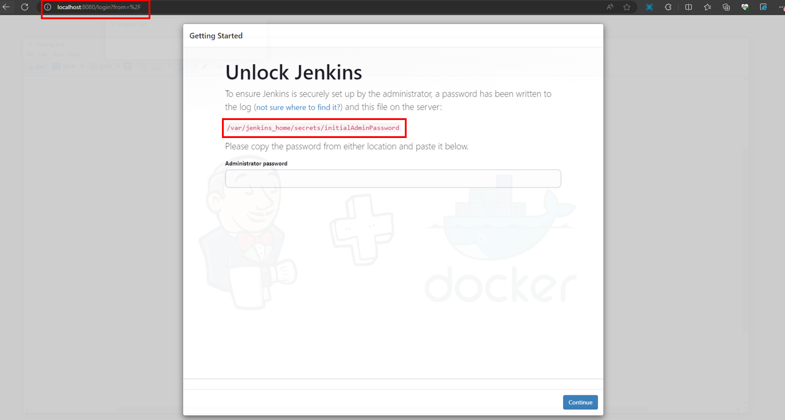
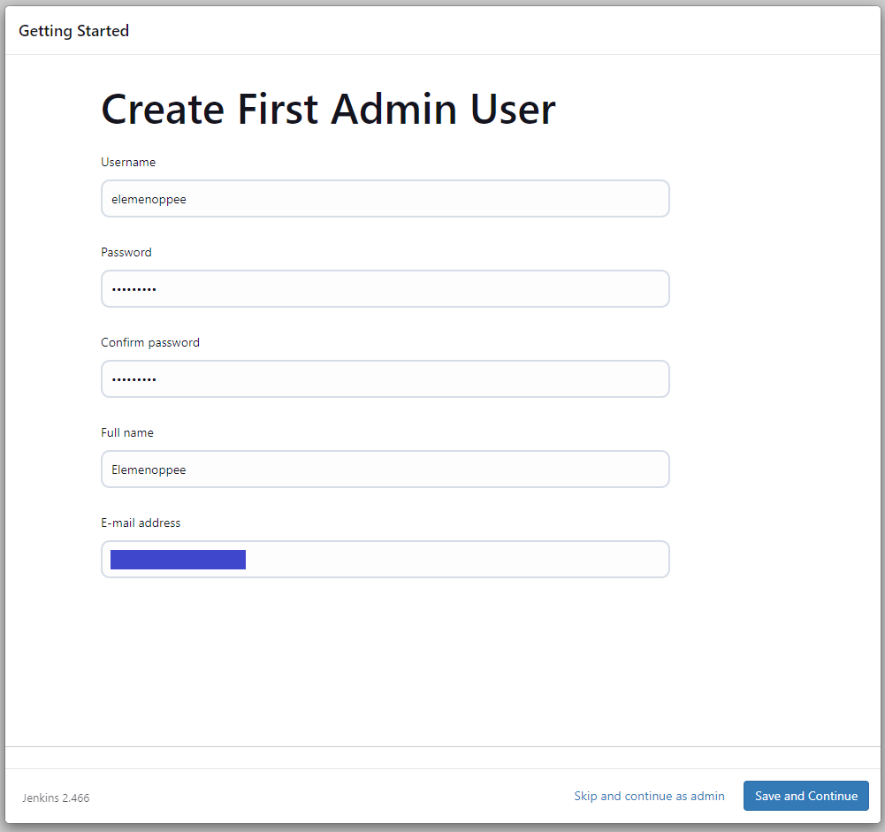
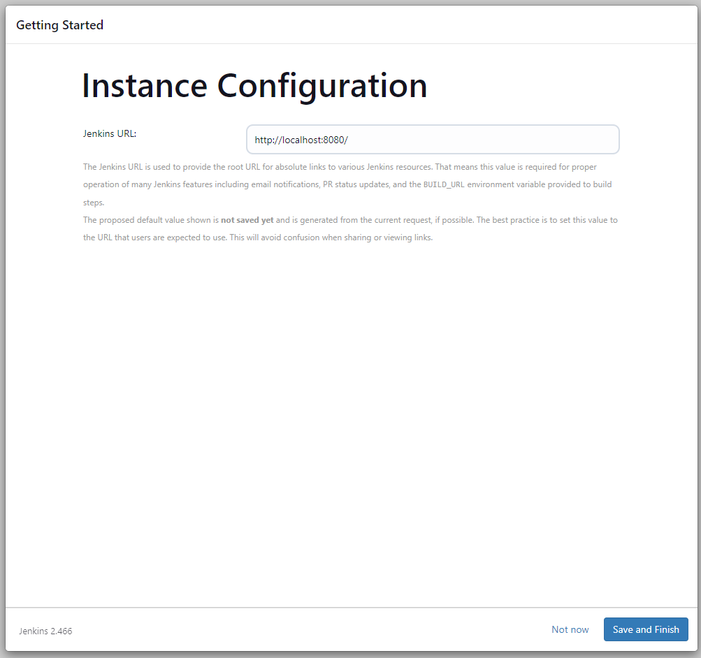
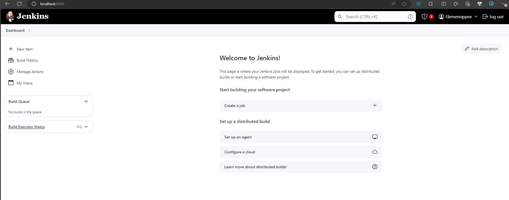

# 🤖 How to Install Jenkins in a Docker Container and Make the Data Persist: A Comprehensive Guide


## Description

Looking to run Jenkins in a Docker container while ensuring your data persists across restarts? This detailed guide will walk you through the process of installing Jenkins in a Docker container and configuring persistent storage, so your data remains intact and accessible.

By the end of this guide, you'll be able to install Jenkins in a Docker container and configure it for persistent storage, ensuring a stable and reliable CI/CD environment. Let's get started!

## Steps 🍀:-

**Step 1** — Install Prerequisites

**Step 2** — Deploy Jenkins Container

## Detailed Step-by-Step Guide 🌸:-

**Step 1** — Install Prerequisites

**1A** — To install Docker Engine

**Note:** For more information, please refere to this official documentation of Docker: https://docs.docker.com/engine/install/ubuntu/. 

Set up Docker's apt repository.

```
# Add Docker's official GPG key:
sudo apt-get update
sudo apt-get install ca-certificates curl
sudo install -m 0755 -d /etc/apt/keyrings
sudo curl -fsSL https://download.docker.com/linux/ubuntu/gpg -o /etc/apt/keyrings/docker.asc
sudo chmod a+r /etc/apt/keyrings/docker.asc

# Add the repository to Apt sources:
echo \
  "deb [arch=$(dpkg --print-architecture) signed-by=/etc/apt/keyrings/docker.asc] https://download.docker.com/linux/ubuntu \
  $(. /etc/os-release && echo "$VERSION_CODENAME") stable" | \
  sudo tee /etc/apt/sources.list.d/docker.list > /dev/null
sudo apt-get update
```

Install the Docker packages.

```
$ sudo apt-get install docker-ce docker-ce-cli containerd.io docker-buildx-plugin docker-compose-plugin
```

Verify that the Docker Engine installation is successful by running the hello-world image.

```
$ sudo docker run hello-world
```

This program launches a test image in a container after downloading it. Upon execution, the container outputs a confirmation message before shutting down.

You have now successfully installed and started Docker Engine.

**Step 2** — Deploy Jenkins Container

**2A** — Pull the Jenkins LTS image from Docker Hub.

```
sudo docker pull jenkins/jenkins
```

**2B** — Create a Docker volume for Jenkins to persist its data. 

We'll make a volume once the image is finished. The volume will save the data we create in this container so that it remains accessible when we create another container later on.

```
sudo docker volume create jenkins
```

Then run this command to check the volume

```
sudo docker volume ls
```

Sample:

```
root@DESKTOP-XXX:~# sudo docker volume ls
DRIVER    VOLUME NAME
local     jenkins
```

**2C** — Run the container with the volume and correct port mapped to the container.

We will set the port to 8080:8080 in our command since that is the port that Jenkins must execute on. With this command, a Jenkins container will be launched that uses our newly created Jenkins volume on port 8080:8080.

```
sudo docker container run -d -it -p 8080:8080 -v jenkins jenkins/jenkins
```

Enter your public IP address (with port number:8080 behind it) in the browser, and the Jenkins website will load stating that you must unlock it. Jenkins fortunately provides us with the password, so let's duplicate that line.



**2D** — Retrieve the Admin password.

Paste the text we copied from Jenkins into the VS Code prompt and type **sudo docker exec (insert yout container ID) cat**. You should receive the password to log in, so make a note of it.

To get the docker container ID

```
$ sudo docker ps
```

Sample Result

```
root@DESKTOP-XXX:~# sudo docker ps
CONTAINER ID   IMAGE             COMMAND                  CREATED         STATUS         PORTS                                                  NAMES
35de1adfef74   jenkins/jenkins   "/usr/bin/tini -- /u…"   6 minutes ago   Up 6 minutes   0.0.0.0:8080->8080/tcp, :::8080->8080/tcp, 50000/tcp   vigorous_heisenberg
```

**Note:** 35de1adfef74 is the Container ID.

Now, execute the **sudo docker exec (put yout container ID) cat** command

```
sudo docker exec 35de1adfef74 cat /var/jenkins_home/secrets/initialAdminPassword
```

Sample Result

```
root@DESKTOP-XXX:~# sudo docker exec 35de1adfef74 cat /var/jenkins_home/secrets/initialAdminPassword
e40d337bdad7430994974c3308fc72da
```

**Note:** e40d337bdad7430994974c3308fc72da is the Administrator password.

Enter the password in Jenkins, choose 'Install Suggested Plugins,' and once the installation is complete, you can create your user.



Lastly, click "Save and Finish".



Your Jenkins Server is now installed and configured.



## Final Note

If you find this repository useful for learning, please give it a star on GitHub. Thank you!

**Authored by:** [ELemenoppee](https://github.com/ELemenoppee)