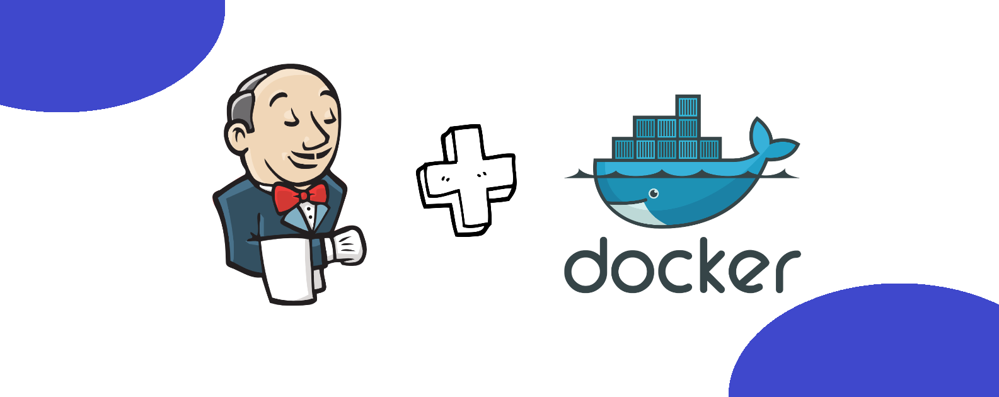
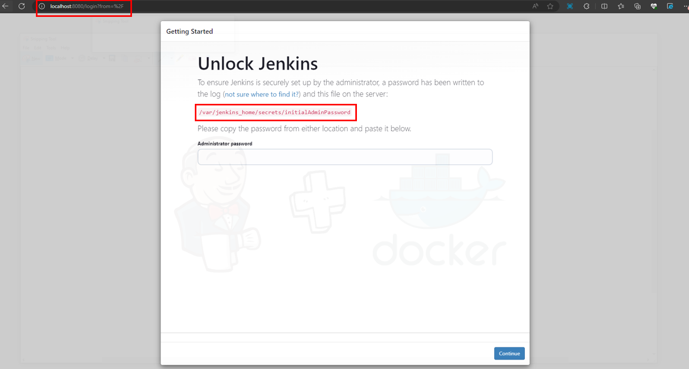
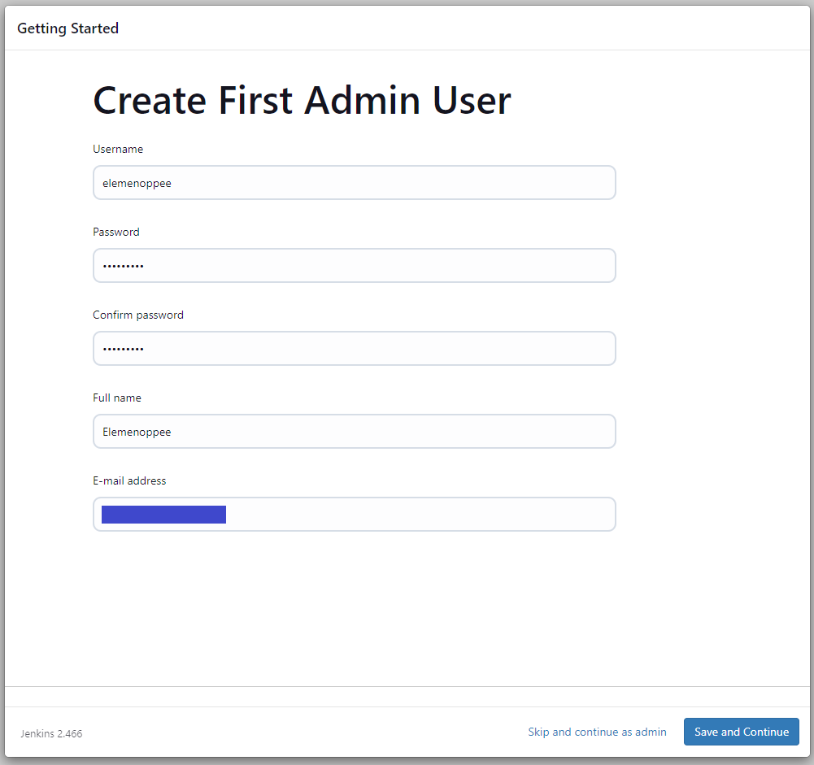
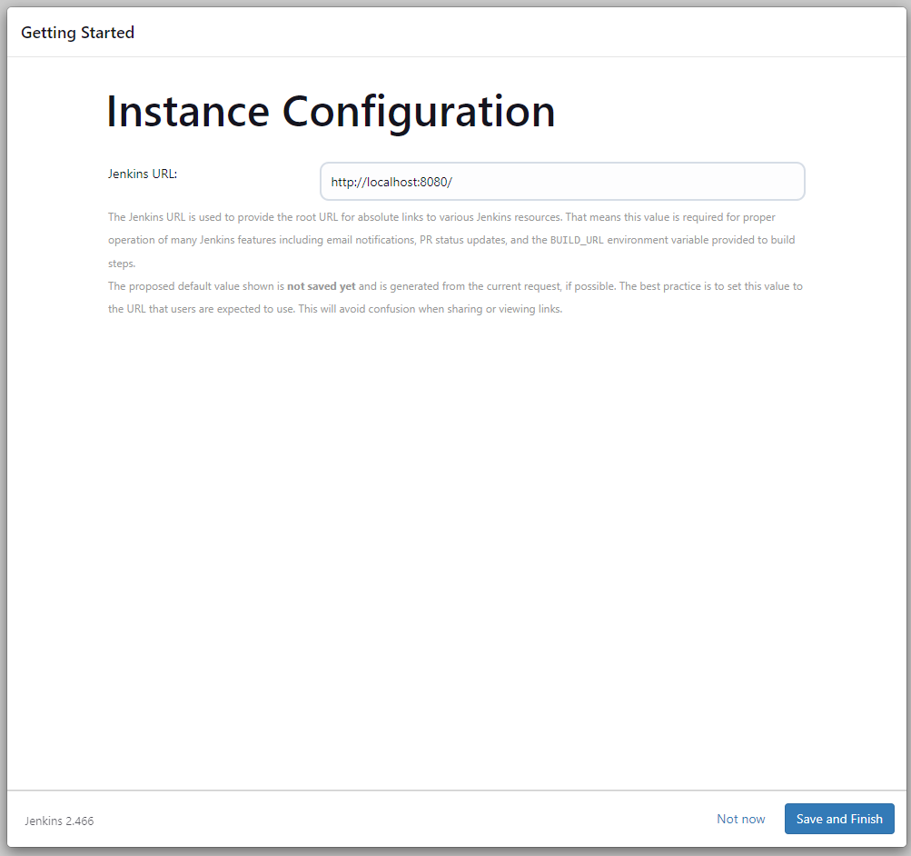
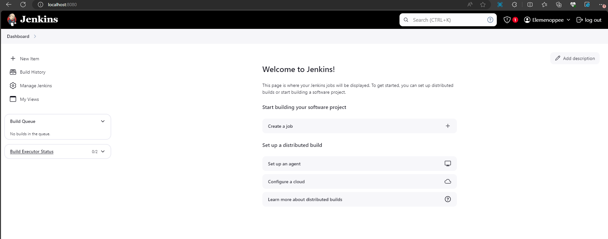

# 🚀 Setting Up Jenkins in a Docker Container with Persistent Data



I wanted to run Jenkins in a Docker container while making sure my data persists across restarts. This guide documents my step-by-step journey of installing Jenkins in a Docker container and configuring persistent storage so that my data remains intact and accessible.

By the end of this guide, you'll see how I installed Jenkins in a Docker container and set it up for persistent storage, ensuring a stable and reliable CI/CD environment. Let's dive in!

## Step 1 — Install Prerequisites

### 1A — Installing Docker Engine

Note: For more information, refer to the official Docker documentation: https://docs.docker.com/engine/install/ubuntu/.

I set up Docker's apt repository using these commands:

```
# Add Docker's official GPG key:
sudo apt-get update
sudo apt-get install ca-certificates curl
sudo install -m 0755 -d /etc/apt/keyrings
sudo curl -fsSL https://download.docker.com/linux/ubuntu/gpg -o /etc/apt/keyrings/docker.asc
sudo chmod a+r /etc/apt/keyrings/docker.asc

# Add the repository to Apt sources:
echo \
  "deb [arch=$(dpkg --print-architecture) signed-by=/etc/apt/keyrings/docker.asc] https://download.docker.com/linux/ubuntu \
  $(. /etc/os-release && echo "$VERSION_CODENAME") stable" | \
  sudo tee /etc/apt/sources.list.d/docker.list > /dev/null
sudo apt-get update
```

Then, I installed the Docker packages:

```
$ sudo apt-get install docker-ce docker-ce-cli containerd.io docker-buildx-plugin docker-compose-plugin
```

To verify the installation, I ran the hello-world image:

```
$ sudo docker run hello-world
```

After running this, I saw a confirmation message, meaning Docker was successfully installed.

## Step 2 — Deploying the Jenkins Container

### 2A — Pulling the Jenkins LTS image from Docker Hub

```
sudo docker pull jenkins/jenkins
```

### 2B — Creating a Docker volume for Jenkins to persist its data

I created a volume to store Jenkins data, ensuring that it remains accessible even if I recreate the container:

```
sudo docker volume create jenkins
```

Then, I verified that the volume was created:

```
sudo docker volume ls
```

Example output:

```
root@DESKTOP-XXX:~# sudo docker volume ls
DRIVER    VOLUME NAME
local     jenkins
```

### 2C — Running the container with the volume and correct port mapping

Since Jenkins runs on port 8080, I executed this command to start the container and link it to my created volume:

```
sudo docker container run -d -it -p 8080:8080 -v jenkins jenkins/jenkins
```

Next, I accessed Jenkins by entering my public IP address followed by port 8080 in my browser. The Jenkins website loaded, asking me to unlock it.



### 2D — Retrieving the Admin password

Jenkins provided a password, which I needed to copy. To get it, I first checked my container ID:

```
$ sudo docker ps
```

Example output:

```
root@DESKTOP-XXX:~# sudo docker ps
CONTAINER ID   image             COMMAND                  CREATED         STATUS         PORTS                                                  NAMES
35de1adfef74   jenkins/jenkins   "/usr/bin/tini -- /u…"   6 minutes ago   Up 6 minutes   0.0.0.0:8080->8080/tcp, :::8080->8080/tcp, 50000/tcp   vigorous_heisenberg
```

The container ID in my case was 35de1adfef74. I used it to retrieve the admin password:

```
sudo docker exec 35de1adfef74 cat /var/jenkins_home/secrets/initialAdminPassword
```

Example output:

```
root@DESKTOP-XXX:~# sudo docker exec 35de1adfef74 cat /var/jenkins_home/secrets/initialAdminPassword
e40d337bdad7430994974c3308fc72da
```

I copied this password, entered it in Jenkins, and clicked 'Install Suggested Plugins.' Once the installation was done, I created my user.



Finally, I clicked "Save and Finish."



Jenkins was now fully installed and configured! 🎉



## Final Thoughts

Setting up Jenkins in a Docker container with persistent storage is a great way to maintain a stable and reliable CI/CD environment. By following this guide, I was able to install Jenkins, configure it with a persistent volume, and retrieve the necessary credentials to access the Jenkins dashboard.

This setup ensures that even if the container stops or is removed, my Jenkins data remains intact, making it easier to manage builds, pipelines, and user configurations without starting from scratch.