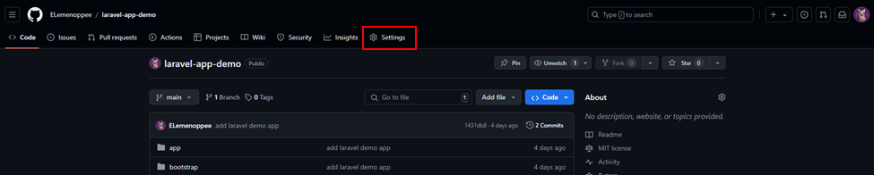
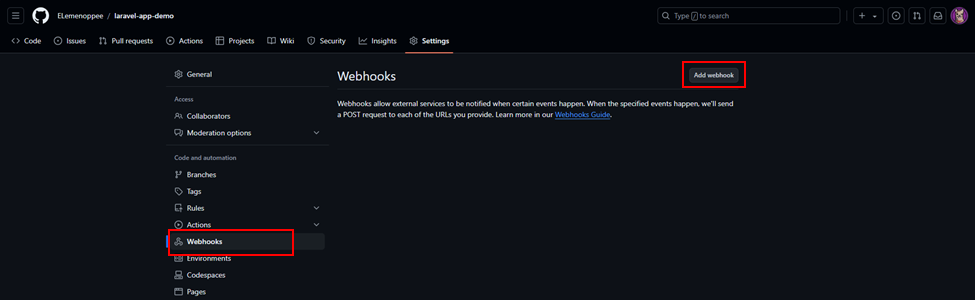
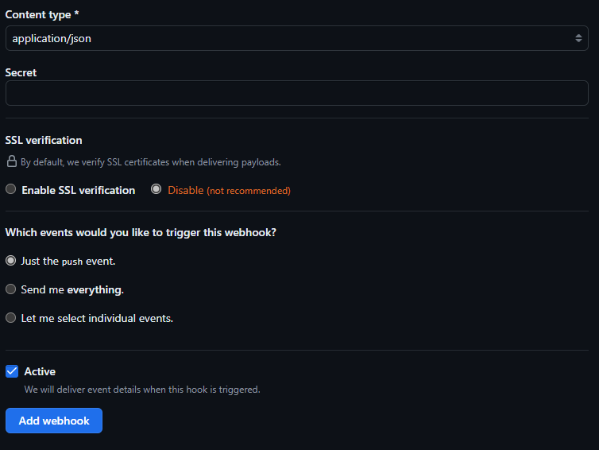
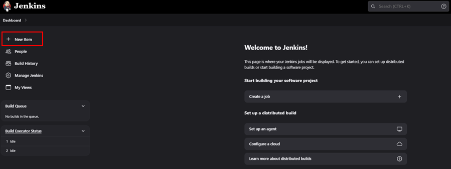
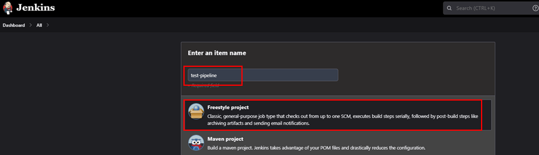
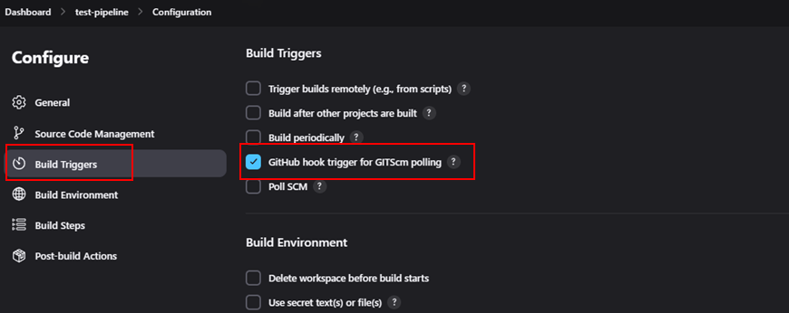
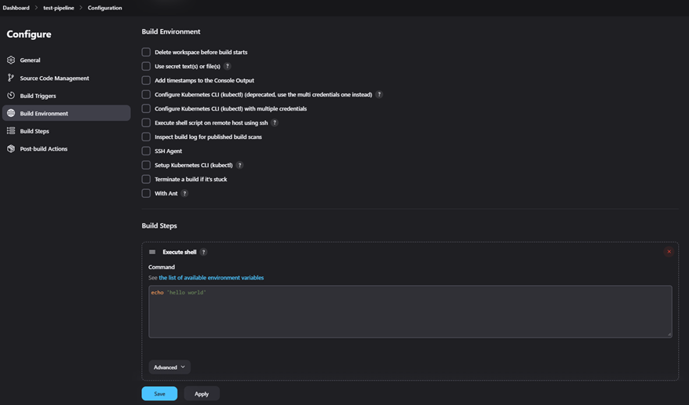
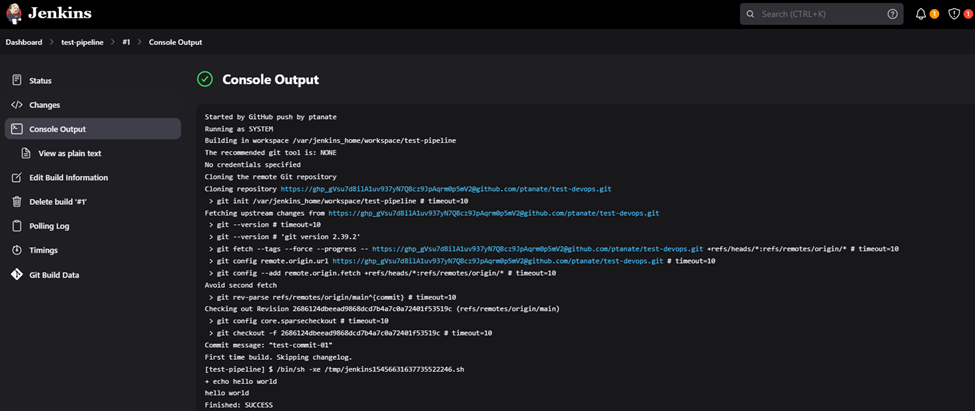

# 🐧How to Integrate GitHub Webhooks with Jenkins: A Complete Step-by-Step Guide

I wanted to automate my CI/CD pipeline so that every time I pushed code to GitHub, Jenkins would automatically trigger a build. To achieve this, I set up GitHub Webhooks with Jenkins, allowing seamless integration between the two.

In this guide, I’ll walk you through the exact steps I followed to make it work. By the end, you’ll be able to:

✅ Configure GitHub webhooks to communicate with Jenkins

✅ Set up Jenkins to automatically trigger builds on code commits

✅ Verify and troubleshoot the integration to ensure everything runs smoothly

Let’s dive in! 🚀

## Step 1: Configuring GitHub Repository Settings

First, I opened my GitHub repository, clicked on Settings, and navigated to the Webhooks section.

Then, I clicked Add Webhook and filled in the details:

In the Payload URL field, I entered my Jenkins server URL followed by /github-webhook/.

Under Content type, I selected application/json.

I left the Secret field empty (but you can set one for added security).

For SSL Verification, I disabled it (not recommended for production but useful for testing).

Finally, I clicked Add Webhook to save my settings.

## Step 2: Setting Up Jenkins to Receive Webhooks

Next, I switched to Jenkins and created a new project:

Clicked New Item in Jenkins.

Gave my project a name, selected Freestyle Project, and clicked OK.

Click on the ‘Source Code Management’ tab.

Under Source Code Management, I selected Git and pasted my GitHub repository URL in the Repository URL field.

In the Build Triggers section, I checked GitHub hook trigger for GITScm polling to allow automatic builds whenever I push changes.

## Step 3: Testing Automatic Jenkins Builds on GitHub Commits

Now, I needed to make sure Jenkins was correctly triggered whenever I pushed new code.

I went to the Build section, clicked Add build step, and selected Execute shell.

Inside the script field, I added a simple command to test my setup.

I made a small edit in one of my GitHub repository files and committed the change.

As soon as I pushed the changes, Jenkins automatically started a new build!

I went back to my Jenkins dashboard and saw that a job had been triggered. To check the logs, I clicked on the Console Output of the build.

## 🎯 Final Thoughts

Setting up GitHub webhooks with Jenkins was a game-changer for my CI/CD workflow. Now, every time I push changes to GitHub, Jenkins automatically takes care of the build process—saving me time and effort.