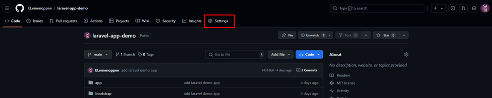
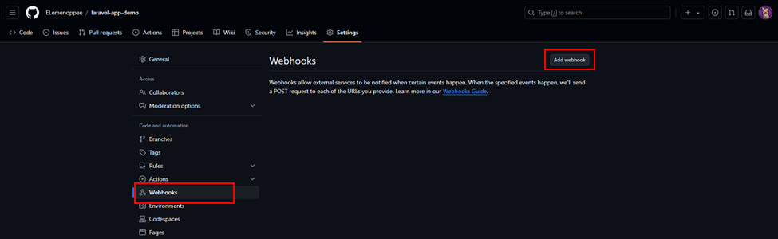
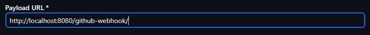
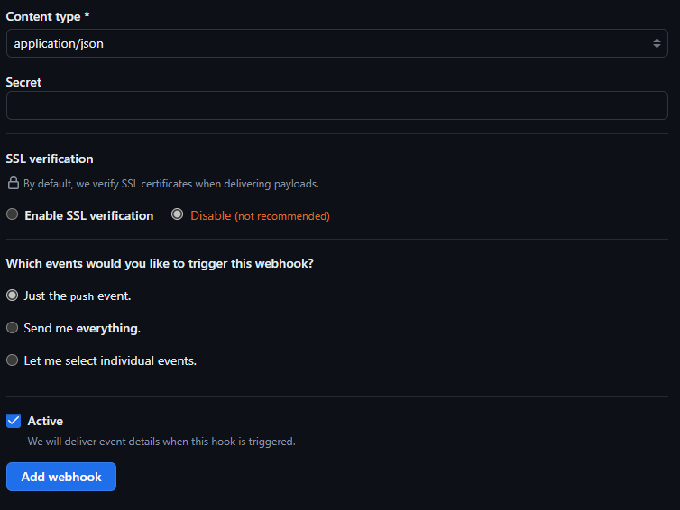
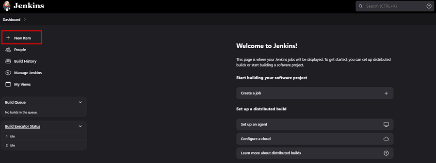
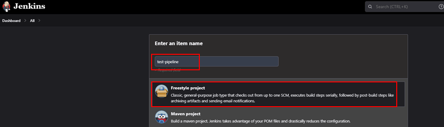
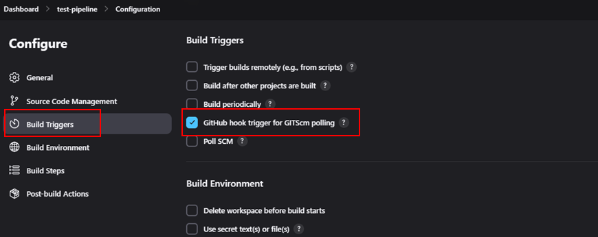
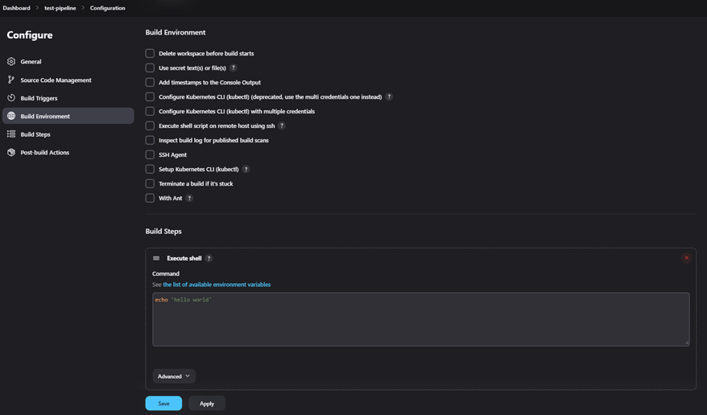
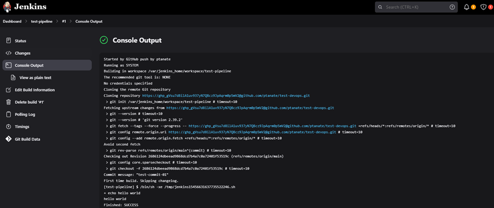

# 🐧Setting Up GitHub Webhooks with Jenkins: A Step-by-Step Guide

## Introduction

Want to automate your CI/CD pipeline by triggering Jenkins builds with GitHub webhooks? This comprehensive guide will walk you through the process of setting up GitHub webhooks with Jenkins, enabling seamless integration and automation for your development workflow.

## Steps 💦:-

**Step 1** — Configure Github Repository settings

**Step 2** — Set up Jenkins for Github webhooks

**Step 3** — Triggering the Jenkins GitHub Integration with Every Code Commit

## Detailed Step-by-Step Guide 🌦:-

**Step 1** — Configure Github Repository settings

Go to your GitHub repository and click on ‘Settings’.

Click on Webhooks and then click on ‘Add Webhook’.

In the ‘Payload URL’ field, paste your Jenkins environment URL. At the end of this URL add /github-webhook/, for example: http://localhost:8080/github-webhook/

In the ‘Content type’ select: ‘application/json’ and leave the ‘Secret’ field empty. Then, in SSL Verification, choose 'Disable (not recommended)'. Lastly, click 'add webhook'

**Step 2** — Set up Jenkins for Github webhooks

In Jenkins, click on ‘New Item’ to create a new project.

Give your project a name, then choose ‘Freestyle project’ and finally, click on ‘OK’. 

Click on the ‘Source Code Management’ tab.

Click on Git and paste your GitHub repository URL in the ‘Repository URL’ field.

Click on the ‘Build Triggers’ tab and then on the ‘GitHub hook trigger for GITScm polling’. Or, choose the trigger of your choice.

**Step 3** — Triggering the Jenkins GitHub Integration with Every Code Commit

Click on the ‘Build’ tab, then click on ‘Add build step’ and choose ‘Execute shell’.

Go back to your GitHub repository, edit the github files and commit the changes. We will now see how Jenkins ran the script after the commit.

Go back to your Jenkins project and you'll see that a new job was triggered automatically from the commit we made at the previous step. Click on the little arrow next to the job and choose ‘Console Output’.

## Final Note

If you find this repository useful for learning, please give it a star on GitHub. Thank you!

**Authored by:** [ELemenoppee](https://github.com/ELemenoppee)