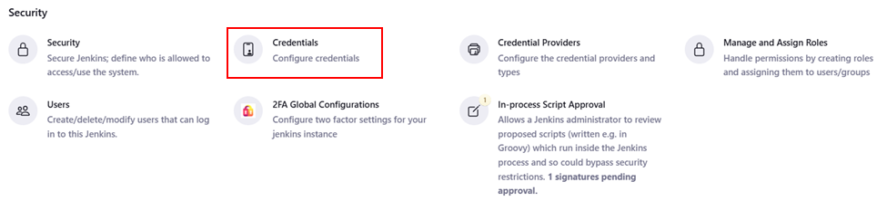
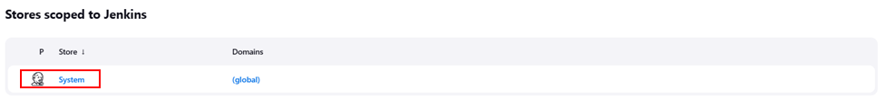
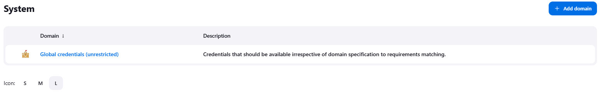
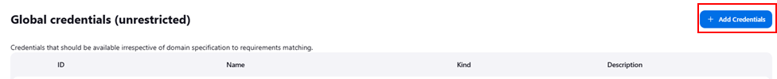
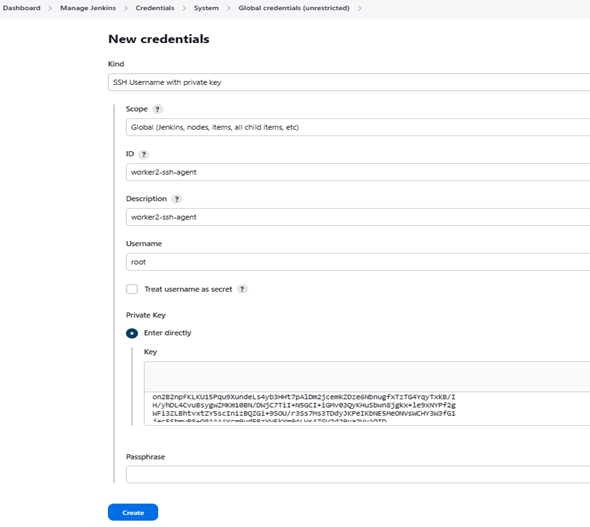

# 🎎Configuring Jenkins SSH-Key Agent to Connect to Remote Servers

## Description

Need to streamline your Jenkins setup to securely connect to remote servers? This comprehensive guide will walk you through configuring the Jenkins SSH-key agent, enabling seamless and secure connections to your remote servers for efficient automation and deployment.

## Steps 🎀:-

**Step 1** — Login to remote servers and generate ssh-keys

**Step 2** — Verify if the key has been generated

```
$ ls -lh .ssh/
```

The result should be like this:

```
root@server1:~# ls -lh .ssh/
total 8.0K
-rw------- 1 root root    0 Apr 15 06:14 authorized_keys
-rw------- 1 root root 2.6K Apr 30 01:47 id_rsa
-rw-r--r-- 1 root root  578 Apr 30 01:47 id_rsa.pub
```

**Step 3** — Add the public key to authorized key

```
$ cat .ssh/id_rsa.pub >> .ssh/authorized_keys
```

**Step 4** — View and copy the private key

```
cat .ssh/id_rsa
```

**Step 5** — Explore "Global Credentials"

Login to Jenkins and go to "Manage Jenkins"


Scroll down, under "Security" click "Credentials"



Under "Store Scoped to Jenkins", click "System"



Under "System", click "Global credentials (underestricted)"



Click "Add Credentials"



**Step 5** — Setting new credentials

Set the required fields:

```
    Kind: SSH Username with private key
    Scope: Global (Jenkins, nodes, items, all child items, etc)
    ID: <any name>
    Description: <same as ID>
    Username: root #Username of your remote server
    Private Key:
        Key: <paste the key>
```



Click "Create".

## Final Note

If you find this repository useful for learning, please give it a star on GitHub. Thank you!

**Authored by:** [ELemenoppee](https://github.com/ELemenoppee)