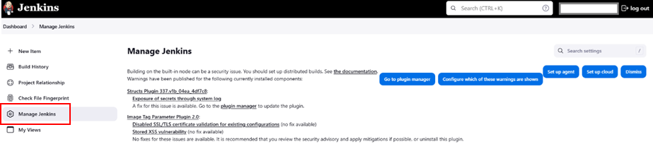
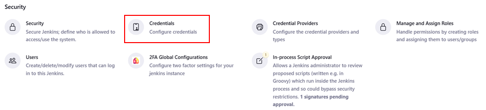
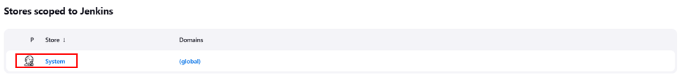
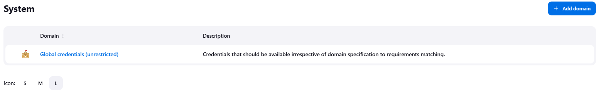
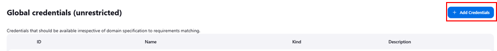
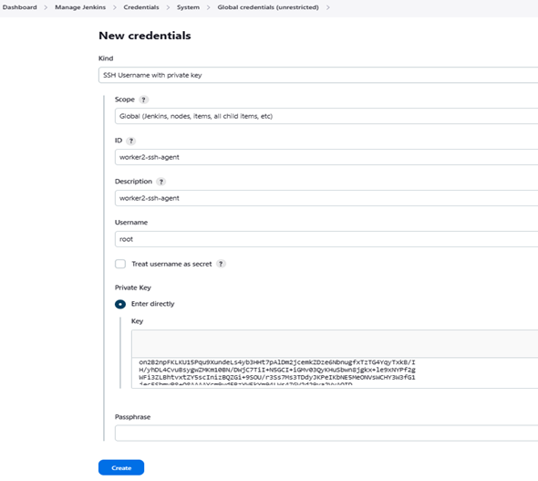

# 🎎Configuring Jenkins SSH-Key Agent to Connect to Remote Servers

I recently needed to set up Jenkins to securely connect to remote servers for automated deployments. Instead of using password-based authentication, I decided to configure SSH key-based authentication for better security and efficiency. In this guide, I’ll walk you through the exact steps I followed to get it working seamlessly.

## Steps 🎀:-

## Step 1: Generating SSH Keys on the Remote Server

First, I logged in to my remote server and generated SSH keys to establish secure authentication.

## Step 2: Verifying SSH Key Generation

To confirm that the SSH keys were successfully created, I ran:

```
$ ls -lh .ssh/
```

Here’s what the output looked like:

```
root@server1:~# ls -lh .ssh/
total 8.0K
-rw------- 1 root root    0 Apr 15 06:14 authorized_keys
-rw------- 1 root root 2.6K Apr 30 01:47 id_rsa
-rw-r--r-- 1 root root  578 Apr 30 01:47 id_rsa.pub
```

## Step 3: Adding the Public Key to the Authorized Keys File

To allow Jenkins to authenticate without a password, I added my public key to the authorized_keys file:

```
$ cat .ssh/id_rsa.pub >> .ssh/authorized_keys
```

## Step 4: Copying the Private Key

Since Jenkins requires the private key to authenticate, I viewed and copied it using:

```
cat .ssh/id_rsa
```

I made sure to store it securely.

## Step 5: Navigating to Jenkins Credentials Manager

Next, I logged into Jenkins and followed these steps:

Went to Manage Jenkins.



Scrolled down to Security and clicked Credentials.



Under Stores Scoped to Jenkins, I clicked System.



Then, under System, I selected Global credentials (unrestricted).



Clicked Add Credentials to create a new entry.



## Step 6: Adding SSH Credentials to Jenkins

I filled in the required fields as follows:

+ Kind: SSH Username with Private Key
+ Scope: Global (Jenkins, nodes, items, all child items, etc.)
+ ID: (Chose a unique name for reference)
+ Description: (Used the same as ID for clarity)
+ Username: root (or the appropriate remote server username)
+ Private Key: Pasted the private key from Step 4



After clicking Create, Jenkins successfully stored my SSH credentials.

## 🎯 Final Thoughts

With this setup, I can now securely connect Jenkins to my remote servers for automation without worrying about passwords. It makes deployments smoother and more secure.