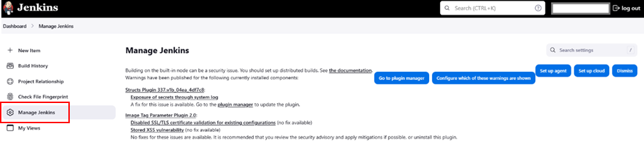
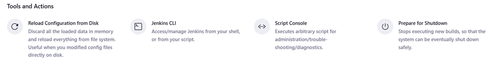

# 🎏Resetting Jenkins Build

## Introduction

Encountering issues with your Jenkins builds and need a fresh start? This step-by-step guide will walk you through the process of resetting Jenkins builds, ensuring you can maintain a clean and efficient CI/CD pipeline.

By this guide, you'll be equipped to reset Jenkins builds effectively, ensuring your CI/CD pipeline runs smoothly. Let's get started!

## Steps 🌸:-

**Step 1** — Login to your Jenkins Server with your credentials

**Step 2** — Exploring Script Console

Go to "Manage Jenkins"



Scroll down, under “Tool and Actions” > “Script Console”



**Step 3** — Running the script

```
item = Jenkins.instance.getItemByFullName("test-dev")
//THIS WILL REMOVE ALL BUILD HISTORY
item.builds.each() { build ->
  build.delete()
}
item.updateNextBuildNumber(1)
item.getNextBuildNumber()
```

**Note:** Change the "test-dev" to actual Jenkins project name.

## Final Note

If you find this repository useful for learning, please give it a star on GitHub. Thank you!

**Authored by:** [ELemenoppee](https://github.com/ELemenoppee)