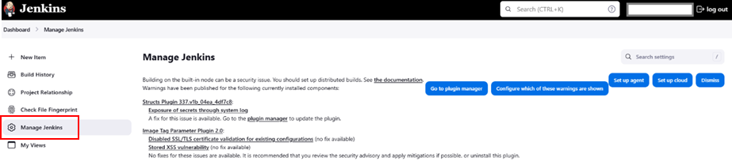
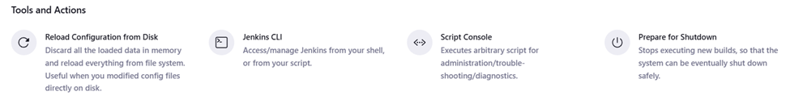

# 🎏Resetting Jenkins Build

I recently encountered issues with my Jenkins builds and needed a fresh start. To keep my CI/CD pipeline clean and efficient, I decided to reset the builds. In this guide, I’ll walk you through the exact steps I took to reset Jenkins builds seamlessly and maintain a smooth development workflow.

If you're facing similar challenges, follow along as I share my process for resetting Jenkins builds effectively.

## Step 1: Logging into Jenkins

The first thing I did was log into my Jenkins server using my credentials.

## Step 2: Accessing the Script Console

I navigated to Manage Jenkins from the dashboard.



I scrolled down to the Tools and Actions section and clicked on Script Console.



## Step 3: Running the Script

To reset the build history of my Jenkins project, I executed the following Groovy script in the Script Console:

```
item = Jenkins.instance.getItemByFullName("test-dev")
//THIS WILL REMOVE ALL BUILD HISTORY
item.builds.each() { build ->
  build.delete()
}
item.updateNextBuildNumber(1)
item.getNextBuildNumber()
```

Important: I replaced "test-dev" with the actual name of my Jenkins project before executing the script.

## Final Thoughts

Resetting my Jenkins builds helped me keep my CI/CD pipeline organized and running efficiently. If you found this guide helpful, consider giving a ⭐ to the repository on GitHub.

Happy coding! 🚀

