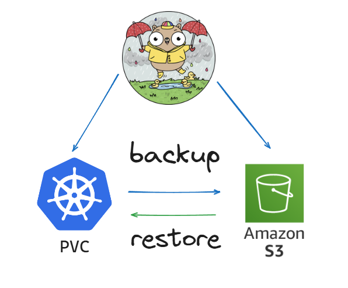
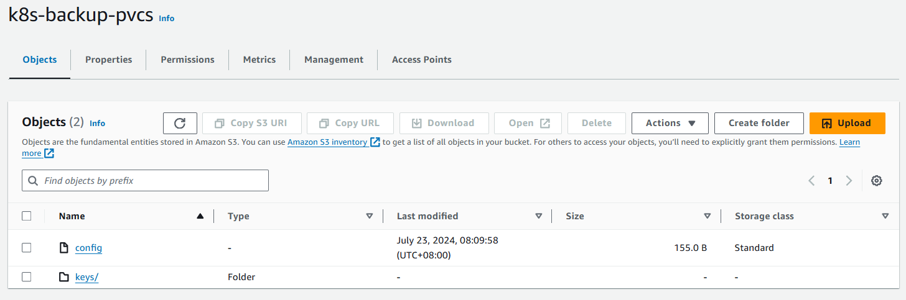

# 😈 Backing Up Kubernetes PVCs to AWS S3 using Restic: On-Demand and Automated Solutions 😈



## Introduction

Ensure your Kubernetes data is securely backed up to AWS S3 using Restic. This comprehensive guide covers on-demand backup, automated backup, on-demand restore, and automated prune of your Kubernetes Persistent Volume Claims (PVCs).

By the end of this guide, you'll have a robust backup solution for your Kubernetes PVCs using Restic and AWS S3, ensuring data safety and reliability. Let's get started!

## Prerequisites 👻

To follow along with this step-by-step tutorial, you should have the following:

 + An Amazon Web Services (AWS) account: You’ll need an active AWS account to create EC2 instances.

 + AWS Console Access: Log in to the AWS Management Console.

## Pre-Steps 🤢:-

The pre-steps are essential preparations that set the groundwork for the main procedure. These steps ensure that all necessary resources and permissions are in place, and required software is installed before proceeding with the core process.

**Step 1** — Create an Amazon S3 Bucket

**Step 2** — Create a User with Required Access to S3 Bucket

**Step 3** — Install Restic

**Step 4** — Initializing Your Repository

## Procedure 🎃:-

The procedure outlines the official steps required to complete the main task. Each step should be followed carefully to ensure the process is executed correctly.

**Procedure A** — On-Demand Backup to S3 Backup

**Procedure B** — Restoring Data From S3 Bucket

**Procedure C** — Backing Up Data Automatically with Restic and Cron

**Procedure D** — Remove Single Snapshot

**Procedure E** — Automatically Remove Snapshots with Restic and Cron

## Detailed Pre-Steps 🤖:-

### **Step 1** — Create an Amazon S3 Bucket

As a first step, you need to create an S3 bucket that will be used for your back-up and recovery backend and the required permission to access the bucket. To do so, run the following command

```
aws s3api create-bucket --bucket <BUCKET_NAME> --region <REGION> --create-bucket-configuration LocationConstraint=<REGION>
```

**Note:** Replace <__REGION__> with your target AWS Region and <__BUCKET_NAME__> for the bucket name.

You can confirm the created S3 bucket at:

```
https://<REGION>.console.aws.amazon.com/s3/home?region=<REGION>
```

### **Step 2** — Create a User with Required Access to S3 Bucket

After creating the back-up and recovery S3 bucket, let’s create an IAM user and attach the required policy to allow access to the bucket.

Firstly, create a file and name it restic-policy.json and paste the following config into it.

*restic-policy.json*:
```
{
	"Version": "2012-10-17",
	"Statement": [
		{
			"Effect": "Allow",
			"Action": [
				"s3:PutObject",
				"s3:ListBucket",
				"s3:GetObject",
				"s3:DeleteObject"
			],
			"Resource": [
				"arn:aws:s3:::<BUCKET_NAME>",
				"arn:aws:s3:::<BUCKET_NAME>/*"
			]
		}
	]
}
```

**Note:** Please change the <__BUCKET_NAME__> in the restic-policy.json file.

This is a policy in AWS that defines the permissions for accessing the S3 bucket named “back-up-restic”. The policy specifies that certain actions can be taken on both the bucket itself and the objects within the bucket. The actions that are allowed include:

+ `“s3:PutObject”`: This allows for putting or uploading an object to the bucket.

+ `“s3:ListBucket”`: This allows for listing the objects in the bucket.

+ `“s3:GetObject”`: This allows for getting or downloading an object from the bucket.

+ `“s3:DeleteObject”`: This allows for deleting an object from the bucket.

The policy specifies that these actions are allowed with an “Effect” of “Allow”. The “Resource” specifies that these actions can be taken on the bucket itself (“arn:aws:s3:::<_BUCKET_NAME_>”) and on any object within the bucket ("arn:aws:s3:::<_BUCKET_NAME_>/*").

Create user.
```
aws iam create-user --user-name k8s-backup-user
```

Output: 
```
{
    "User": {
        "Path": "/",
        "UserName": "k8s-backup-user",
        "UserId": "AIDARUXW3BEFUZ4VDAEJ2",
        "Arn": "<ARN>",
        "CreateDate": "2024-07-22T01:09:30+00:00"
    }
}
```

Attach the policy to the user.
```
aws iam put-user-policy --user-name k8s-backup-user --policy-name restic-policy --policy-document file://restic-policy.json
```

**Note:** Make sure that **file://restic-policy.json** is set to the location of the json file you created earlier.


This command creates an IAM user with the name “restic-user”. The “&&” operator allows you to chain commands together. So after creating the user, the command attaches a policy to the user with the name “restic-policy”. The policy document is stored in a local file called “restic-policy.json”, and the “aws iam put-user-policy” command is used to attach the policy to the user.

A Restic IAM user has been created and policy attached. Next, you need to create the programmatic access key. Restic will use this key to assume the user’s identity. To do so, run the following command:

```
aws iam create-access-key --user-name restic-user
```

Store the AWS_ACCESS_KEY_ID and AWS_SECRET_ACCESS_KEY in a safe place, as we’ll use them in the next steps.

### **Step 3** — Install Restic

Restic stores data in the encrypted repository, and whenever you add data to the repository, Restic can automatically create a new snapshot. But before taking advantage of the Restic backup utility, you’ll first have to install Restic on your machine.

```
dnf install restic
```

You now have Restic installed on your machine; you can verify the installation with the **restic version** command.

Create a file named **.restic.env** in your home directory. Inside this file, you are going to add lines for each of the 4 required environment variables. Use the example block below, replacing the values with your own.

.restic.env:
```
export AWS_ACCESS_KEY_ID="<AWS_ACCESS_KEY_ID>"
export AWS_SECRET_ACCESS_KEY="<AWS_SECRET_ACCESS_KEY>"
export RESTIC_PASSWORD="<AWS_SECRET_ACCESS_KEY>"
export RESTIC_REPOSITORY="s3:s3.<REGION>.amazonaws.com/<BUCKET_NAME>"
```

This file contains sensitive data that needs to be protected from other users with chmod permissions set to read-only:

```
 chmod 400 ~/.restic.env
```

Next, you need to activate these environment variables in your current bash session:

```
source ~/.restic.env
```

Using this method, your shell credentials will only be active when you need them, rather than being readily available. To confirm that the credentials are set please run the following command:

```
echo $RESTIC_REPOSITORY
```

### **Step 4** — Initializing Your Repository

Having configured the Restic credentials for accessing your S3 bucket, the next step is to set up a new repository. With Restic, backup data is stored in the initialized repository, and each backup action creates a new snapshot. In this case, the repository is this S3 bucket you created. To initialize this repository, run the following command:

```
restic init
```

Sample Output:
```
root@master-1:~# restic init
created restic repository 14c67ae8b5 at s3:<REGION>.amazonaws.com/<BUCKET_NAME>

Please note that knowledge of your password is required to access
the repository. Losing your password means that your data is
irrecoverably lost.
```

To confirm the initialization process, on your browser, go to:
```
https://<_REGION_>.console.aws.amazon.com/s3/buckets/<_BUCKET_NAME_>?region=<_REGION_>
```



Restic initialization configuration has been generated in the S3 bucket, but you can also verify the repository on the command line. To do so run the following commands:

```
restic check
```

Sample Result:
```
root@master-1:~# restic check
using temporary cache in /tmp/restic-check-cache-3642825458
repository 14c67ae8 opened successfully, password is correct
created new cache in /tmp/restic-check-cache-3642825458
create exclusive lock for repository
load indexes
check all packs
check snapshots, trees and blobs
[0:00]          0 snapshots
no errors were found
```

## Procedures 👓:-

### **Procedure A** — On-Demand Backup to S3 Backup

To begin, you will create a file that will be backed up to S3:

```
mkdir backup-file
cd backup-file
```

Now create first-backup.txt in the backup-file/ directory, with your preferred editor and add the following:

first-backup.txt:

```
The quick brown fox jumps over the lazy dog
```

Having created the backup-file, the next step is to back it up to S3:

```
restic backup backup-file
```

Sample Output:

```
repository d6cf85c7 opened successfully, password is correct
created new cache in /root/.cache/restic
no parent snapshot found, will read all files

Files:           2 new,     0 changed,     0 unmodified
Dirs:            1 new,     0 changed,     0 unmodified
Added to the repo: 1.833 KiB

processed 2 files, 795 B in 0:01
snapshot e37357cd saved
```

Next run the following command to list the snapshot taken:

```
restic snapshots
```

Sample Output:

```
repository d6cf85c7 opened successfully, password is correct
ID        Time                 Host                   Tags        Paths
-----------------------------------------------------------------------------------------------------------------------
e37357cd  2024-07-23 00:11:43  master-01              /root/backup-file
-----------------------------------------------------------------------------------------------------------------------
1 snapshots
```

### **Procedure B** — Restoring Data From S3 Bucket

Backups aren’t complete without their ability to restore files. In the previous section, you backed up the file. Now, let’s delete the first backup file from your machine and restore it from the S3 bucket.

Firstly, in the ~/backup-file directory, run the following command to delete the first-backup.txt file:

```
rm -r first-backup.txt
```

After deleting the text file, the next step is to restore it. Firstly, you should get the id of the text file snapshot. To do so run the following command:

```
restic snapshots
```

Sample Output:

```
repository d6cf85c7 opened successfully, password is correct
ID        Time                 Host                   Tags        Paths
-----------------------------------------------------------------------------------------------------------------------
e37357cd  2024-07-23 00:11:43  master-01              /root/backup-file
-----------------------------------------------------------------------------------------------------------------------
1 snapshots
```

After getting the snapshot ID the next step is to restore the deleted file by running the following command:

```
restic restore e37357cd --target /
ls
```

Sample Output:

```
repository 14c67ae8 opened successfully, password is correct
restoring <Snapshot e37357cd of [/root/backup-file] at 2024-07-22 02:27:20.806248909 +0000 UTC by root@master-01> to ../backup-file
```

### **Procedure C** — Backing Up Data Automatically with Restic and Cron

At this point, you’ve already learned all the basic usage of the Restic backup tool. But since manually backing up data can be a pain, why not automatically backup data on your Unix system? Restic, together with Cron, can do wonders, such as automating data backup process. In this section, you will set up a cron job to backup every minute. First, make a file that specifies the location of the directories we want to backup.

In the current directory, create a file named restic.files, and add the following configurations into it:

```
/backup-file
```

This file contains the path to all of the directories you want to backup. The same command-line method that you used earlier will work, but you will find it easier to work with a file as the directory you want to back up expands.

Next, you’ll set up a cron job to backup the specified directory in the ‘restic.files’ text file every one minute. Run the crontab command below to create a new cron job.

```
crontab -e
```

This will open up a file in vim for you. This file is essentially where you can list out your cron jobs — each job on its own line. Once you’re on the vim screen, hit A to put the editor into INSERT mode, paste the following cron job configuration:

```
*/1 * * * * . ~/.restic.env ; restic \
backup --files-from=/root/restic.files \
--tag automated 2>> /root/restic.err >> /root/restic.log
```

This is a cron expression for scheduling a task (using cron) to run the restic backup program every minute (/1 ** *). It starts by loading environment variables from the file ~/.restic.env using the . (dot) command. Then it runs the restic backup command with the following options:

+ `--files-from` specifies the file containing the list of files to be backed up. Change this to the location of the restic.files you created earlier

+ `--tag` adds a tag “automated” to the backup.

+ The `2>>` and >> redirect the standard error and standard output respectively to files in the ~/backup-file directory.

Make sure you change the--files-from=/root/restic.files to the location of the restic file you created.

After typing out the cron expression, hit esc and then type :wq to save and exit vim. After exiting the vim editor. Wait a minute and then confirm that crontab is working. To do so run the following command:

```
restic snapshots
```

Sample Result:

```
repository d6cf85c7 opened successfully, password is correct
ID        Time                 Host                   Tags        Paths
-----------------------------------------------------------------------------------------------------------------------
e37357cd  2024-07-23 00:11:43  master-01                        /root/backup-file
38682899  2024-07-23 00:48:01  master-01            automated   /root/backup-file
9d6ad534  2024-07-23 00:49:01  master-01            automated   /root/backup-file
b58318fa  2024-07-23 00:50:02  master-01            automated   /root/backup-file
-----------------------------------------------------------------------------------------------------------------------
4 snapshots
```

Now that you’ve created an automated backup system with Restic, you can run the following command to see how much S3 storage you’re using:

```
restic stats
```

Sample Output:

```
repository d6cf85c7 opened successfully, password is correct
scanning...
Stats in restore-size mode:
Snapshots processed:   15
   Total File Count:   144
         Total Size:   1.597 KiB
```

### **Procedure D** — Remove Single Snapshot

list all snapshots in a repository:

```
restic snapshots
```

Sample Output:

```
repository d6cf85c7 opened successfully, password is correct
ID        Time                 Host                   Tags        Paths
-----------------------------------------------------------------------------------------------------------------------
e37357cd  2024-07-23 00:11:43  master-01                        /root/backup-file
38682899  2024-07-23 00:48:01  master-01            automated   /root/backup-file
9d6ad534  2024-07-23 00:49:01  master-01            automated   /root/backup-file
b58318fa  2024-07-23 00:50:02  master-01            automated   /root/backup-file
-----------------------------------------------------------------------------------------------------------------------
4 snapshots
```

In order to remove the snapshot of 38682899, use the forget command and specify the snapshot ID on the command line:

```
restic forget 38682899 --prune
```

Sample Output:

```
repository d6cf85c7 opened successfully, password is correct
[0:00] 100.00%  1 / 1 files deleted
1 snapshots have been removed, running prune
loading indexes...
loading all snapshots...
finding data that is still in use for 14 snapshots
[0:00] 100.00%  14 / 14 snapshots
searching used packs...
collecting packs for deletion and repacking
[0:00] 100.00%  10 / 10 packs processed

to repack:            6 blobs / 2.893 KiB
this removes          1 blobs / 385 B
to delete:            0 blobs / 0 B
total prune:          1 blobs / 385 B
remaining:           53 blobs / 23.771 KiB
unused size after prune: 0 B (0.00% of remaining size)

repacking packs
[0:00] 100.00%  1 / 1 packs repacked
rebuilding index
[0:00] 100.00%  10 / 10 packs processed
deleting obsolete index files
[0:00] 100.00%  9 / 9 files deleted
removing 1 old packs
[0:00] 100.00%  1 / 1 files deleted
done
```

### **Procedure E** — Automatically Remove Snapshots with Restic and Cron

Create a script that will run the restic forget and restic prune commands with your desired retention policy.

```
vi cronjob-backup-prune.sh
```

add the following lines to this script:

```
#!/bin/bash

# Source the Restic environment variables
source ~/.restic.env

# Run the forget command with your retention policy
restic forget --keep-last=7 --keep-weekly=4 --keep-monthly=12 --prune

# Log the output (optional)
echo "$(date) - Forget and Prune Completed" >> /root/restic-maintenance.log 2>&1
```

This argument is configuring the retention policy for a backup system using Restic, a backup program. Each line is specifying a different aspect of the retention policy for backups. Here's a breakdown of each part:

+ `forget`: This is a command in Restic that tells it to forget certain snapshots (i.e., backup points) according to the policies specified by the following options.

+ `--keep-last=7`: This option tells Restic to keep the last 7 snapshots. So, it will retain the 7 most recent backups.

+ `--keep-weekly=4`: This tells Restic to keep the last 4 weekly snapshots. It will keep one snapshot per week for the last 4 weeks.

+ `--keep-monthly=12`: This specifies that Restic should keep the last 12 monthly snapshots. It will retain one snapshot per month for the last 12 months.

+ `--prune`: This command is used to remove the data that is no longer needed by the snapshots that were forgotten. Essentially, it cleans up the repository by deleting the data associated with the forgotten snapshots.

Make the script executable:

```
chmod +x cronjob-backup-prune.sh
```

Edit your cron jobs to include the new maintenance task.

```
crontab -e
```

Add the following line to run the forget and prune script daily at 2 AM (you can adjust the timing as needed):

```
0 2 * * * /bin/bash cronjob-backup-prune.sh
```

## Final Note

If you find this repository useful for learning, please give it a star on GitHub. Thank you!

**Authored by:** [ELemenoppee](https://github.com/ELemenoppee)