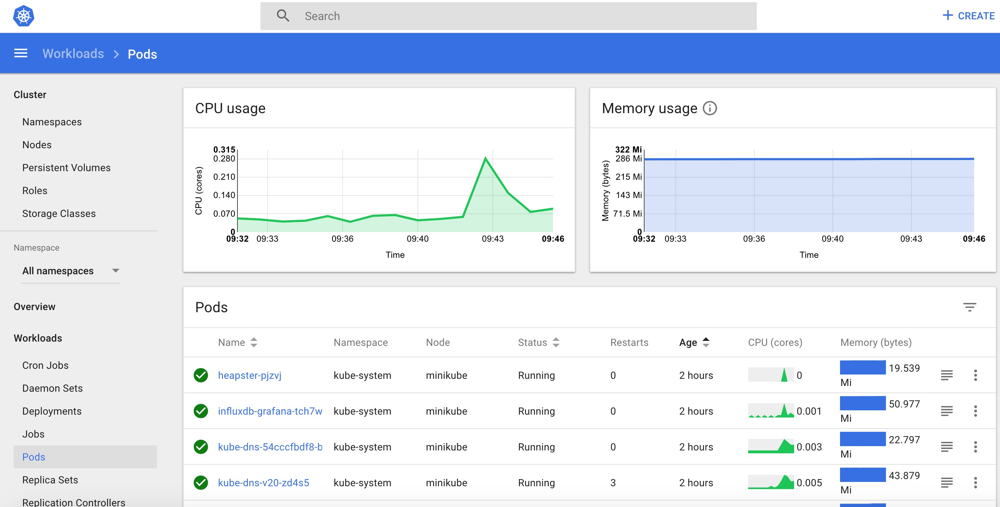

# 🚀 Setting Up Kubernetes Dashboard: My Step-by-Step Guide



Managing a Kubernetes cluster efficiently requires a robust interface, and that’s where the Kubernetes Dashboard comes in. This web-based UI allows me to monitor, troubleshoot, and manage my cluster with ease.

In this guide, I’ll walk you through the entire process of setting up and accessing the Kubernetes Dashboard. By the end, you'll have a fully functional dashboard, making cluster management more intuitive and streamlined. Let's dive in!

## 📌 Prerequisites

Before I begin, I made sure I had the following:

✅ A running Kubernetes cluster

✅ kubectl installed and configured

✅ Access to the cluster's master node

## Step 1: Access the Master Node

First, I logged into the master node of my Kubernetes cluster:

```sh
ssh user@my-master-node
```

## Step 2: Deploy Kubernetes Dashboard

To install the Kubernetes Dashboard, I applied the official YAML manifest:

```
$ kubectl apply -f https://raw.githubusercontent.com/kubernetes/dashboard/v2.7.0/aio/deploy/recommended.yaml
```

## Step 3: Verify the Deployment

I ensured that all necessary resources had been successfully installed by running:

```
$ kubectl get all -n kubernetes-dashboard
```

Expected output:

```
root@k8prod-master-01:~# kubectl get all -n kubernetes-dashboard
NAME                                             READY   STATUS    RESTARTS   AGE
pod/dashboard-metrics-scraper-5657497c4c-5bqj8   1/1     Running   0          2m13s
pod/kubernetes-dashboard-78f87ddfc-kg5xh         1/1     Running   0          2m13s

NAME                                TYPE        CLUSTER-IP       EXTERNAL-IP   PORT(S)    AGE
service/dashboard-metrics-scraper   ClusterIP   10.96.127.30     <none>        8000/TCP   2m14s
service/kubernetes-dashboard        ClusterIP   10.102.157.143   <none>        443/TCP    2m14s

NAME                                        READY   UP-TO-DATE   AVAILABLE   AGE
deployment.apps/dashboard-metrics-scraper   1/1     1            1           2m13s
deployment.apps/kubernetes-dashboard        1/1     1            1           2m14s

NAME                                                   DESIRED   CURRENT   READY   AGE
replicaset.apps/dashboard-metrics-scraper-5657497c4c   1         1         1       2m13s
replicaset.apps/kubernetes-dashboard-78f87ddfc         1         1         1       2m14s

```

## Step 4: Expose the Dashboard Using NodePort

By default, the Kubernetes Dashboard is only accessible within the cluster. To make it accessible externally, I modified the service type:

```
$ kubectl edit service/kubernetes-dashboard -n kubernetes-dashboard
```

I found the following line:

```
  type: ClusterIP
```

And changed it to:

```
  type: NodePort
```

After saving and exiting, I verified the update.

## Step 5: Verify the Service Exposure

I ran the command below to check if the service type had been updated successfully:

```sh
kubectl get service -n kubernetes-dashboard
```

The output looked like this:

```
NAME                   TYPE       CLUSTER-IP       EXTERNAL-IP   PORT(S)         AGE
kubernetes-dashboard   NodePort   10.102.157.143   <none>        443:30861/TCP   9m
```

I noted the NodePort value (30861 in this example), as I’d need it to access the Dashboard.

## Step 6: Create an Admin Service Account

To access the Dashboard with full privileges, I created a service account and role binding.

First, I created a new directory and YAML file:

```
$ mkdir dashboard
$ cd dashboard
$ vi k8s-serviceaccount.yaml
```

Then, I added the following configuration:

```
apiVersion: v1
kind: ServiceAccount
metadata:
  name: dashboard-admin
  namespace: kubernetes-dashboard
---
apiVersion: rbac.authorization.k8s.io/v1
kind: ClusterRoleBinding
metadata:
  name: cluster-admin-rolebinding
roleRef:
  apiGroup: rbac.authorization.k8s.io
  kind: ClusterRole
  name: cluster-admin
subjects:
- kind: ServiceAccount
  name: dashboard-admin
  namespace: kubernetes-dashboard
```

I saved the file and applied it using:

```
$ kubectl apply -f k8s-serviceaccount.yaml
```

## Step 7: Generate an Authentication Token

To log in to the Dashboard, I needed an authentication token. I generated one using:

```
$ kubectl create token dashboard-admin -n kubernetes-dashboard
```

I copied and saved this token securely for the next step.

## Step 8: Access the Kubernetes Dashboard

Now, I could access the Dashboard by opening the following URL in my browser:

```
http://<MASTER_IP_ADDRESS>:<KUBERNETES_DASHBOARD_SERVICE_PORT>/
```

I replaced <MASTER_IP_ADDRESS> with my Kubernetes master node's IP and <NODEPORT> with the port number from Step 5 (e.g., 30861).

## Step 9: Log In to the Dashboard

When prompted, I selected Token authentication and pasted the token generated in Step 7. I clicked Sign In, and that was it! I now had full access to my Kubernetes Dashboard.

## 🎯 Wrapping Up

And that’s it! I successfully set up and accessed the Kubernetes Dashboard. Now, I can manage workloads, troubleshoot issues, and monitor my cluster more efficiently.