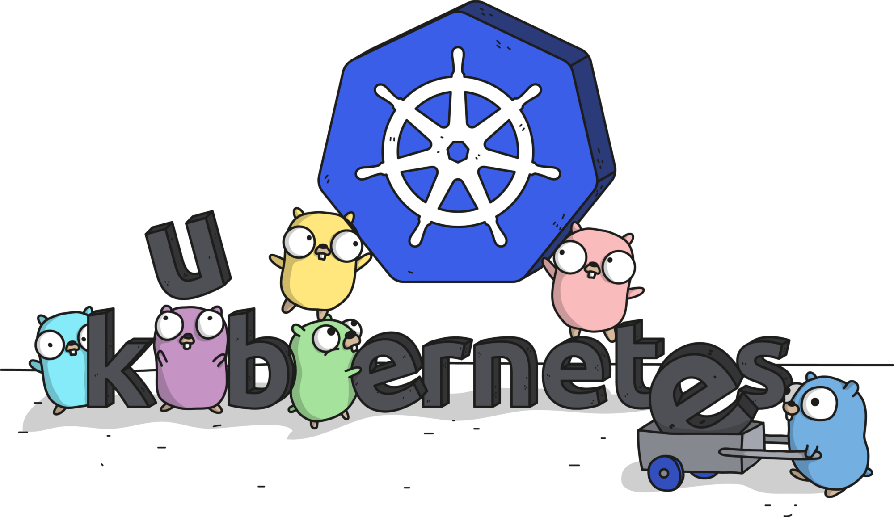
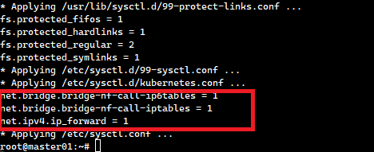
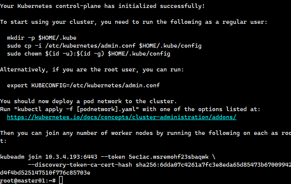
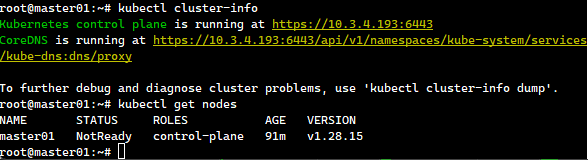
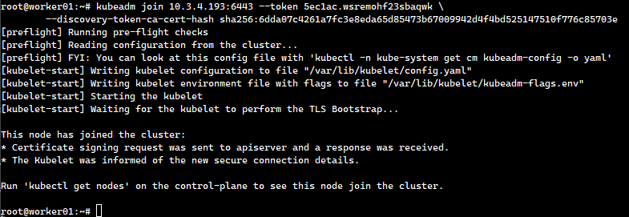
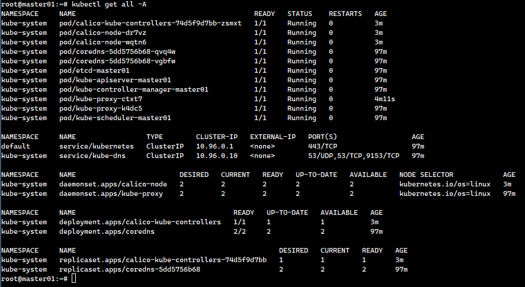
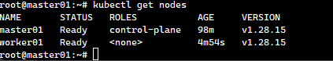

# Setting Up a Kubernetes Cluster from Scratch



This guide provides a step-by-step approach to setting up a Kubernetes cluster. The instructions apply to both master and worker nodes unless otherwise specified.

## Step 1: Configure Hostnames

Each node requires a unique hostname. Log in to each machine and set the hostname accordingly:

```sh
sudo hostnamectl set-hostname "master-01" # For the master node
sudo hostnamectl set-hostname "worker-01" # For a worker node
exec bash
```

## Step 2: Update the Hosts File

Modify the /etc/hosts file on each node to ensure proper name resolution:

```sh
<master_ip_address> <master_hostname>
<worker_ip_address> <worker_hostname>
```

Step 3: Disable Swap and Configure Kernel Parameters

Kubernetes requires swap to be disabled. Run the following commands:

```sh
sudo swapoff -a
sudo sed -i '/ swap / s/^\(.*\)$/#\1/g' /etc/fstab
```

Load the required kernel modules:

```sh
sudo tee /etc/modules-load.d/containerd.conf << EOF
overlay
br_netfilter
EOF

sudo modprobe overlay
sudo modprobe br_netfilter
```

Set essential kernel parameters for Kubernetes networking:

```sh
sudo tee /etc/sysctl.d/kubernetes.conf <<EOT
net.bridge.bridge-nf-call-ip6tables = 1
net.bridge.bridge-nf-call-iptables = 1
net.ipv4.ip_forward = 1
EOT
```

Apply the changes:

```sh
sudo sysctl --system
```

Sample Output:



## Step 4: Install Container Runtime (Containerd)

First, install required dependencies:

```sh
sudo apt install -y curl software-properties-common apt-transport-https ca-certificates
```

### Enable the Docker Repository

```sh
sudo mkdir -p /etc/apt/trusted.gpg.d

sudo curl -fsSL https://download.docker.com/linux/ubuntu/gpg | sudo gpg --dearmour -o /etc/apt/trusted.gpg.d/docker.gpg

sudo rm /etc/apt/sources.list.d/archive_uri-https_download_docker_com_linux_ubuntu-jammy.list

sudo add-apt-repository --remove "deb [arch=amd64] https://download.docker.com/linux/ubuntu $(lsb_release -cs) stable"

sudo add-apt-repository "deb [arch=amd64] https://download.docker.com/linux/ubuntu $(lsb_release -cs) stable"
```

### Install Containerd

```sh
sudo apt update
sudo apt install -y containerd.io
```

### Configure Containerd to Use Systemd as the Cgroup Driver

```sh
containerd config default | sudo tee /etc/containerd/config.toml >/dev/null 2>&1
sudo sed -i 's/SystemdCgroup \= false/SystemdCgroup \= true/g' /etc/containerd/config.toml
```

Restart and enable Containerd:

```sh
sudo systemctl restart containerd
sudo systemctl enable containerd
```

## Step 5: Install Kubernetes Components

### Add Kubernetes Repository

```sh
sudo mkdir -p /etc/apt/keyrings
curl -fsSL https://pkgs.k8s.io/core:/stable:/v1.28/deb/Release.key | sudo gpg --dearmor -o /etc/apt/keyrings/kubernetes-apt-keyring.gpg
echo "deb [signed-by=/etc/apt/keyrings/kubernetes-apt-keyring.gpg] https://pkgs.k8s.io/core:/stable:/v1.28/deb/ /" | sudo tee /etc/apt/sources.list.d/kubernetes.list
```

### Install Kubectl, Kubeadm, and Kubelet

```sh
sudo apt update
sudo apt install -y kubelet kubeadm kubectl
sudo apt-mark hold kubelet kubeadm kubectl
```

## Step 6: Initialize the Kubernetes Cluster (Master Node Only)

On the master node, initialize the cluster:

```sh
sudo kubeadm init --pod-network-cidr=10.244.0.0/16
```

Sample output:



Once completed, configure kubectl to interact with the cluster:

```sh
mkdir -p $HOME/.kube
sudo cp -i /etc/kubernetes/admin.conf $HOME/.kube/config
sudo chown $(id -u):$(id -g) $HOME/.kube/config
export KUBECONFIG=/etc/kubernetes/admin.conf
```

Verify the cluster status:

```sh
kubectl cluster-info
kubectl get nodes
```

sample output:



## Step 7: Join Worker Nodes to the Cluster

On each worker node, run the kubeadm join command provided in the master node output. It should resemble the following:

```sh
kubeadm join 10.3.4.193:6443 --token 5ec1ac.wsremohf23sbaqwk \
        --discovery-token-ca-cert-hash sha256:6dda07c4261a7fc3e8eda65d85473b67009942d4f4bd525147510f776c85703e
```

sample output:



## Step 8: Install a Network Plugin (Calico)

For pod communication, install the Calico network plugin on the master node:

```sh
kubectl apply -f https://raw.githubusercontent.com/projectcalico/calico/v3.26.0/manifests/calico.yaml
```

Verify that all components are running:

```sh
kubectl get all -A
```

sample output:



Check that all nodes are ready:

```sh
kubectl get nodes
```

sample output:



## Conclusion

You have now successfully set up a Kubernetes cluster with master and worker nodes. This setup ensures your environment is ready for deploying containerized applications efficiently. 🚀
