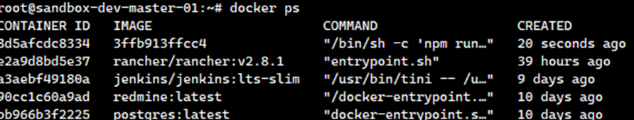

#  Deploying and Configuring Selenium with Docker: A Complete Guide 🐳

## Introduction

Want to optimize your automated testing with a flexible and scalable solution? This in-depth guide will take you through the process of deploying and configuring Selenium with Docker, providing you with a powerful setup for running your Selenium tests efficiently.

By this guide, you will have a fully operational Selenium Grid running with Docker, ready to execute your automated tests efficiently and effectively. Let's get started on your journey to better test automation!

## Steps 🧷:-

**Step 1** — Go inside the Jenkins container

Check container ID

```
$ docker ps
```

Sample Result:



Execute the following command to enter inside the Jenkins container

```
$ docker exec -it a3aebf49180a /bin/bash
```

**Note:** a3aebf49180a is a Container ID.

**Step 2** — Install Selenium

Input the following commands to install selenium.

```
$ apt-get update
$ apt-get install python3
$ apt-get install python3-pip
```

**Step 3** — Install Dependencies

Enter the following commands to install dependencies.
```
$ apt-get install python3-selenium
$ apt-get install python3-pytest
$ apt-get install python3-requests
$ pip install pytest-html --break-system-packages
```

## Final Note

If you find this repository useful for learning, please give it a star on GitHub. Thank you!

**Authored by:** [ELemenoppee](https://github.com/ELemenoppee)
