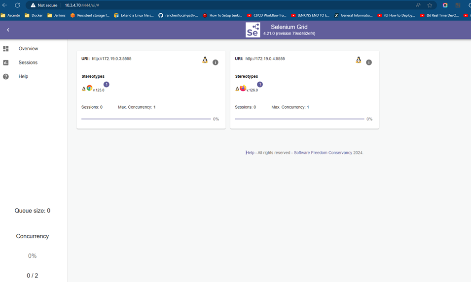

#  Set Up Selenium Grid with Docker: A Step-by-Step Guide 📌

## Description

Are you looking to streamline your automated testing with a robust and scalable solution? This comprehensive guide will walk you through the process of setting up Selenium Grid with Docker, enabling you to run your tests in parallel across different browsers and operating systems efficiently.

## Steps:-

**Step 1** — Deploy docker network and run the docker hub

```
$ docker network create grid
$ docker run -d -p 4442-4444:4442-4444 --net grid --name selenium-hub selenium/hub:4.21.0-20240522
```

**Step 2** — Deploy a testing browser to Selenium Grid

For Google Chrome: 

```
docker run -d --net grid -e SE_EVENT_BUS_HOST=selenium-hub \
    --shm-size="2g" \
    -e SE_EVENT_BUS_PUBLISH_PORT=4442 \
    -e SE_EVENT_BUS_SUBSCRIBE_PORT=4443 \
    selenium/node-chrome:125.0.6422.76
```

For Firefox:

```
docker run -d --net grid -e SE_EVENT_BUS_HOST=selenium-hub \
    --shm-size="2g" \
    -e SE_EVENT_BUS_PUBLISH_PORT=4442 \
    -e SE_EVENT_BUS_SUBSCRIBE_PORT=4443 \
    selenium/node-firefox:126.0
```

For Edge:

```
docker run -d --net grid -e SE_EVENT_BUS_HOST=selenium-hub \
    --shm-size="2g" \
    -e SE_EVENT_BUS_PUBLISH_PORT=4442 \
    -e SE_EVENT_BUS_SUBSCRIBE_PORT=4443 \
    selenium/node-edge:4.21.0-20240522
```

**Note:** Change the browser version if needed.

Result: 



**Step 3** — Add codes below

```
@pytest.fixture(params=[('chrome', '125.0'), ('firefox', '126.0')])
# @pytest.fixture(params=[('firefox', '126.0')])
def driver(request):
    browser, version = request.param
    selenium_grid_url = 'http://10.3.4.70:4444/wd/hub'

    if browser == 'chrome':
        options = webdriver.ChromeOptions()
        options.browser_version = version
        options.add_argument('--headless')
        capabilities = options.to_capabilities()
    elif browser == 'firefox':
        options = webdriver.FirefoxOptions()
        options.browser_version = version
        options.add_argument('--headless')
        options.set_capability('acceptInsecureCerts', True)
        capabilities = options.to_capabilities()
    else:
        raise ValueError(f"Unsupported browser: {browser}")

    driver = webdriver.Remote(
        command_executor=selenium_grid_url,
        # desired_capabilities=capabilities
        options=options
    )
    yield driver
    driver.quit()
```

## Final Note

If you find this repository useful for learning, please give it a star on GitHub. Thank you!

**Authored by:** [ELemenoppee](https://github.com/ELemenoppee)